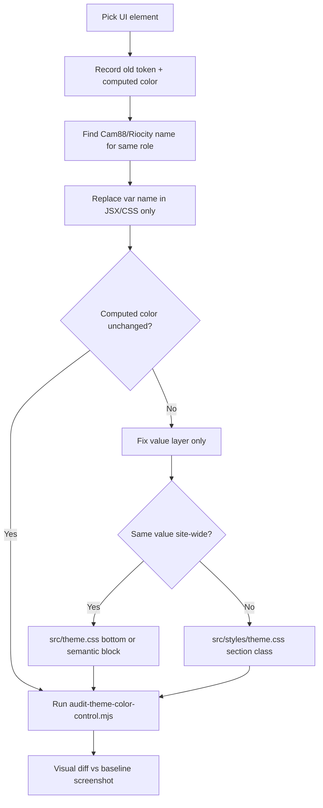

# Figma Variable Rules (Cross-Site Reuse)

> **Purpose:** On new sites, pages, and modules, **reuse the same variable names**. To switch brand or theme, change `data-theme` and CSS files only — **do not** rename `--color-*` in code, and do not hardcode hex values.
>
> **Full variable list:** [VARIABLES.md](./VARIABLES.md) (regenerate after Figma sync: `node scripts/generate-variables-doc.mjs`)
>
> **Chinese version:** [VARIABLE-RULES.md](./VARIABLE-RULES.md)

---

## 1. Core Principles (Must Remember)

| Rule | Description |
|------|-------------|
| **Stable names** | Published `--color-*` / `--mono-*` names are treated as API — **do not rename or delete casually** (see [THEME_CSS_INCREMENTAL_UPDATE.md](./THEME_CSS_INCREMENTAL_UPDATE.md)) |
| **Components use semantics only** | In HTML/CSS/components write `var(--color-surface)`, not `var(--mono-900)`, not `#222222` — full allowlist and layer rules: **§10.1** |
| **Theme changes values, not names** | Default ↔ CAM88 share the same names; values resolve in `theme.css` / `theme-cam88.css` respectively |
| **New names for new modules only** | Add a token only when Figma introduces a **new UI role/module**; do not invent `--color-my-card-bg` for the same button or surface |
| **Figma is the design source** | Add variables in Figma `02 Semantic`, bind aliases, sync to the repo, then reference in the site |

### Caelo repo (this project)

| Rule | Action |
|------|--------|
| Runtime CSS | `src/index.css` → [src/theme.css](./src/theme.css) + [src/styles/theme.css](./src/styles/theme.css) only |
| Riocity reference | [src/theme-riocity.css](./src/theme-riocity.css) — **read-only** name allowlist; **do not import** |
| Product skin | Keep Caelo blue/white + gold CTA; **do not** use `data-theme="cam88"` for this site |
| Migration | Full Riocity → Caelo rules: **§13** |

---

## 2. Two-Layer Structure (Figma ↔ CSS)

```
01 Primitives (Value)     →  hex / rgba, physical palette
        ↑ alias
02 Semantic (Default / CAM88 / …)  →  UI roles; each Mode may point to a different primitive
        ↑
   Web components reference only this layer’s CSS names
```

| Layer | Figma collection | Who uses it | Figma example | CSS example |
|-------|------------------|-------------|---------------|-------------|
| Raw colors | `01 Primitives` | Design system maintainers; **sites generally do not reference directly** | `mono/700` | `--mono-700` |
| Semantic colors | `02 Semantic` | **All pages, components, new sites** | `color/text/primary` | `--color-text-primary` |
| Gradient composites | `02 Semantic` start/end pairs | For `linear-gradient` backgrounds | `color/gradient/home/cta/start` + `/end` | `--color-gradient-home-cta` |

### Figma → CSS naming formula

1. Replace `/` in the Figma path with `-`
2. Prefix with `--`

```
mono/700              →  --mono-700
brand/500             →  --brand-500
raw-brand-cam         →  --raw-brand-cam
color/surface/float   →  --color-surface-float
color/gradient/home/cta/start + end  →  --color-gradient-home-cta
```

---

## 3. Semantic Variable Modules (first path segment)

New tokens must live under an existing **module**. Do not invent a parallel naming system.

| Module (`color/{module}/…`) | Purpose | Example reference |
|-----------------------------|---------|-------------------|
| `text` | Text color, headings, links, placeholders | `--color-text-primary` |
| `surface` | Backgrounds, cards, inputs, tables, floating layers | `--color-surface`, `--color-surface-float` |
| `border` | Borders, dividers | `--color-border`, `--color-border-brand` |
| `button` | Button bg/text, pagination, CTA series | `--color-button-cta`, `--color-button-nav` |
| `primary` | Brand primary (global CTA) | `--color-primary` |
| `accent` | Accent, gold, chips | `--color-accent` |
| `error` / `danger` / `success` / `warning` | State colors | `--color-error-strong` |
| `overlay` | Overlays, scrims | `--color-overlay` |
| `icon` | Icon colors | `--color-icon-um` |
| `gradient` | Gradient stops (pairs) + composite `--color-gradient-*` | `--color-gradient-home-cta` |
| `popup` / `progress` / `table` / `sticky-nav` / `scrollbar` | Matching UI blocks | See [VARIABLES.md §7](./VARIABLES.md) |

**When a new name is OK:** Figma adds a **new module or role** (e.g. `color/surface/rtp-card`).  
**When it is not:** You only need a similar gray — reuse existing `color/surface/*` or `color/text/*`.

---

## 4. Onboarding a New Site (Copy and Use)

### 4.1 Import CSS

```html
<link rel="stylesheet" href="/path/to/theme.css" />
<link rel="stylesheet" href="/path/to/theme-cam88.css" />
```

### 4.2 Choose a theme

| Brand / Figma Mode | `data-theme` | Semantics loaded from |
|--------------------|--------------|------------------------|
| Default (RioCity9) | `default` or omit | `:root` in `theme.css` |
| CAM88 | `cam88` | `theme-cam88.css` |

```html
<html lang="en" data-theme="cam88">
```

### 4.3 Component style template

```css
/* ✅ Correct: semantic variables */
.page {
  background: var(--color-surface);
  color: var(--color-text-primary);
}
.card {
  background: var(--color-surface-float);
  border: 1px solid var(--color-border);
}
.btn-primary {
  background: var(--color-primary);
  color: var(--color-text-cta-inverse);
}
.hero {
  background: var(--color-gradient-home-cta);
}

/* ❌ Avoid */
.bad { background: #222222; }
.bad { color: var(--mono-0); }   /* unless debugging primitives */
```

### 4.4 React / Vue / Tailwind, etc.

- **CSS Modules / SCSS:** Same — write `var(--color-*)`
- **Tailwind:** Map in `theme.extend.colors` to `var(--color-surface)`, etc. — **do not** redefine a separate color naming system in Tailwind
- **Inline styles:** Still use `style={{ background: 'var(--color-surface)' }}`

---

## 5. Common Semantic Variables (Start Here on New Pages)

Aligned with [VARIABLES.md §7](./VARIABLES.md); covers ~80% of new-site scenarios:

| Scenario | CSS variable |
|----------|--------------|
| Page background | `--color-surface` |
| Primary text | `--color-text-primary` |
| Secondary text | `--color-text-secondary` |
| Muted text | `--color-text-muted` |
| Brand primary / main CTA | `--color-primary` |
| Default border | `--color-border` |
| Card / floating layer | `--color-surface-float` |
| Input background | `--color-surface-input` |
| Links | `--color-text-link` |
| Error / success / warning | `--color-error-strong` / `--color-success-strong` / `--color-warning` |
| Sticky top bar | `--color-sticky-nav` + `--color-text-sticky-nav-text` |
| Overlay | `--color-overlay` |

If no role fits: search [VARIABLES.md](./VARIABLES.md) first, then add a semantic in Figma — do not hardcode in code first.

---

## 6. Gradient Rules

1. In Figma use `color/gradient/{path}/start` and `…/end` as two semantic variables (aliased to primitives)
2. CSS exposes one composite: `--color-gradient-{path}` (`/` → `-`)
3. Sites reference only the composite:

```css
.banner {
  background: var(--color-gradient-home-cta);
}
```

`color/table/highlight/start|end` → `--color-gradient-table`.

### 6.1 Caelo: where gradient colors live (`src/theme.css` `:root`)

> **Rule:** Gradient **stop hex** and **composite formulas** both belong in **`src/theme.css`**. Stops use `--raw-gradient-*` / `--raw-scrim-*`; composites use **`--color-gradient-*` semantic names** (same names as `theme-riocity.css`). Do **not** put stop hex, `linear-gradient(...)`, or `--raw-gradient-{feature}` full composites in components or in `src/styles/theme.css`.

| Layer | Variable pattern | Where | Used by |
|-------|------------------|-------|---------|
| **Stops** | `--raw-gradient-{feature}-start` / `-end` | `theme.css` `:root` (Caelo block below `--color-table-highlight`) | `--color-gradient-*` formulas only |
| **Scrim stops** | `--raw-scrim-*` | Same `:root` block | Overlays, glows, multi-layer `--color-gradient-*` |
| **Composite (required)** | `--color-gradient-{path}` | `theme.css` semantic block **or** Caelo override at bottom of `:root` | Components + all `.bg-gradient-*` utilities |

**Workflow when adding or restoring a gradient**

1. Add or update **stop hex** as `--raw-gradient-{feature}-start/end` (and `--raw-scrim-*` if needed) in `src/theme.css`.
2. Assign the **formula** to a **`--color-gradient-*` semantic name** in the same file:
   - Shared UI → nearest Riocity `--color-gradient-*` (see §13.6).
   - Same Riocity name, different UI area → **section-scoped override** of that `--color-gradient-*` (§13.11), still in `theme.css` stops + formula using `var(--raw-*)`.
3. In `src/styles/theme.css`, utilities and components reference **`var(--color-gradient-*)` only** — never inline `linear-gradient(...)`, never `--raw-gradient-{feature}` composites, never stop hex.
4. Multiple utilities may share one `--color-gradient-*` token; one utility class may scope a different formula onto the same semantic name (App Download pattern).

```css
/* ✅ src/theme.css — stops + semantic composite */
--raw-gradient-promo-card-start: #d8f3ff;
--raw-gradient-promo-card-end: #a6d7f2;
--color-gradient-referral-card: linear-gradient(180deg, var(--raw-gradient-promo-card-start) 0%, var(--raw-gradient-promo-card-end) 100%);

/* ✅ src/styles/theme.css — utility uses semantic name only */
.bg-gradient-promo-card { background-image: var(--color-gradient-referral-card); }

/* ❌ src/styles/theme.css — no formulas or raw composites here */
.bg-gradient-promo-card { background-image: var(--raw-gradient-promo-card); }
.bg-gradient-promo-card { background-image: linear-gradient(180deg, #d8f3ff 0%, #a6d7f2 100%); }
```

---

## 7. Primitive Groups (For Understanding Aliases Only)

Sites do not reference these directly, but they help explain where `--color-*` resolves:

| Prefix | Meaning |
|--------|---------|
| `mono/*` | Neutral grays |
| `brand/*` | Brand green (Default primary source) |
| `accent/*` | Gold / promotional emphasis |
| `support/*` | Success, error, links, etc. |
| `overlay/*` | Semi-transparent overlays |
| `raw-*` | Brand/scene-specific (many CAM88 semantics point here) |
| `raw-gradient-*` | Physical colors for gradient stops |

---

## 8. Multi-Mode / Brand-Only Variables

- Each **Mode** in `02 Semantic` (Default, CAM88, KH168…) may alias the same Figma name to a **different** primitive
- On the web, **variable names stay the same**; only `data-theme` selects which CSS file applies
- Some variables exist only in Default (e.g. `--color-button-cta-category`) — CAM88 pages must not rely on names not exported; see [VARIABLES.md §3](./VARIABLES.md)

---

## 9. Checklist When Adding Variables in Figma

1. **Can you reuse?** Search `02 Semantic` for a similar role (`surface`, `text`, `button`…)
2. **Naming:** `color/{module}/{role}`, consistent with existing paths (kebab-case, `/` for hierarchy)
3. **Alias:** Point to `01 Primitives` (or chain to another semantic; export keeps the direct alias)
4. **Scopes:** Set TEXT_FILL / FRAME_FILL as needed; avoid `ALL_SCOPES`
5. **Every brand Mode** gets an alias (Default + CAM88 at minimum)
6. **Sync repo:**
   ```bash
   node scripts/renew-both-themes.mjs
   node scripts/audit-themes.mjs
   node scripts/generate-variables-doc.mjs
   ```
7. **New site:** Add `var(--color-new-name)` only — do not rename existing names

---

## 10. Do Not

| Do not | Reason |
|--------|--------|
| Use hex/rgb in components | Breaks theming |
| Use `--mono-*` / `--brand-*` in components | Bypasses semantics; CAM88 will not align |
| Invent a second name for the same UI (e.g. `--card-bg`) | Inconsistent with Figma / other sites |
| Delete or rename CSS variables on sync | Breaks live pages |
| Change resolved **color values** when migrating to Cam88 / Riocity semantic names | Migration is **rename only** — alias new names to the **same** Caelo value chain (§13.11) |
| Use `-` as a primitive name in Figma (e.g. `color-button-cta-end`) | Treated as semantic shape; primitives use `group/name` or `raw-*` |

### 10.1 Semantic-only surface (Caelo website)

> **Rule:** Anything the **user sees** (pages, components, JSX `className`, inline `style`) must resolve colors through **`--color-*` semantic names** from the Riocity allowlist ([src/theme-riocity.css](./src/theme-riocity.css)). **Do not** reference Figma **01 Primitives** or Caelo value-layer tokens in UI code.

**In one sentence:** components speak **semantic** (`--color-*`); only `src/theme.css` speaks **primitive** (`--mono-*`, `--brand-*`, `--raw-*`).

#### Where each layer may live

| Layer | Token examples | Allowed in |
|-------|----------------|------------|
| **01 Primitives** | `--mono-*`, `--brand-*`, `--accent-*` (numeric scale), `--support-*`, `--raw-*` | **`src/theme.css` only** — semantic block aliases + Caelo block below `--color-table-highlight` |
| **02 Semantic (Riocity API)** | `--color-text-primary`, `--color-surface-base`, `--color-gradient-home-cta`, … | **Components**, **`src/styles/theme.css` utilities**, scoped section classes |
| **Legacy Caelo layout/effect** (not Riocity API) | `--shadow-*`, `--inset-*`, `--nav-top-pill-*`, `--surface-base`, `--surface-utility-*`, `--radius-*`, `--tracking-*` | **`src/styles/theme.css` definitions only** — wrap in utility classes; **do not** add new inline `var(--shadow-*)` in JSX |
| **Hardcoded paint** | `#…`, `rgb(…)`, Tailwind palette (`bg-blue-500`) | **Nowhere** in product UI (SVG brand assets / ThemeEditor dev tools excepted) |

#### Components (`src/components/**/*.jsx`) — use only

```tsx
// ✅ Semantic color from Riocity allowlist
className="bg-[var(--color-surface-base)] text-[var(--color-text-primary)]"

// ✅ Shared utility whose CSS already uses --color-* (preferred)
className="btn-theme-cta-soft surface-card bg-gradient-promo-card"

// ❌ Primitive
className="text-[var(--mono-0)]"

// ❌ Legacy Caelo alias (no color- prefix)
className="hover:bg-[var(--surface-base)]"

// ❌ Layout/effect primitive in JSX — move to a utility in styles/theme.css
className="shadow-[var(--shadow-card-soft)]"
```

#### `src/styles/theme.css` — utilities

| Do | Don’t |
|----|-------|
| Reference **`var(--color-*)`** in `background`, `color`, `border-color`, `background-image` | Put `--raw-*` / `--mono-*` / `--brand-*` on the **right-hand side of a CSS property** except inside a **section-scoped `--color-*` re-alias** (§13.11) |
| Define legacy `--shadow-*` / `--inset-*` once at the top and expose `.shadow-card-soft` etc. | Introduce new Caelo-only **`--color-*`** names not in `theme-riocity.css` (e.g. `--color-accent-200`) |
| Section-scope: `--color-border-brand: var(--raw-border-accent);` on a wrapper class | Inline `linear-gradient(...)` with stop hex in utilities (§6.1) |

#### `src/theme.css` — the only primitive home

- Semantic block: each `--color-*` → `var(--mono-*)` / `var(--brand-*)` / `var(--raw-*)` / another `--color-*`.
- Below `--color-table-highlight`: `--raw-*` stop hex and Caelo palette overrides.
- **Never** import `theme-riocity.css` at runtime.

#### Audit (run after token changes)

```bash
node scripts/audit-theme-color-control.mjs
```

Output: [docs/theme-color-audit-data.json](./docs/theme-color-audit-data.json). Treat **`primitiveDirect`**, **`disallowedSemantic`**, and inline **`shadow-*` / `inset-*` / legacy `surface-*`** in components as migration backlog.

#### Codebase snapshot (2026-06-08)

| Finding | Approx. count | Where | Action |
|---------|---------------|-------|--------|
| `--color-*` in components | ~2,900 refs | Most UI files | ✅ Correct layer |
| Direct `--mono-*` / `--brand-*` / `--raw-*` in components | **0** | — | ✅ None |
| Legacy `--surface-base` / `--surface-utility-*` | **2** | `Navbar.jsx` (mobile menu close / More icon) | Replace with `--color-surface-base` + semantic icon color |
| `--shadow-*` inline in JSX | **~257** | ~80 component files | Move to utilities (`.shadow-card-soft`, …) or semantic shadow tokens when Figma adds them |
| `--inset-*` inline in JSX | **~25** | Navbar, RegisterPage, modals, … | Same — utility classes only |
| `--raw-*` / `--mono-*` in `styles/theme.css` | **~64** | Scoped re-aliases, page shells, gradient formulas | OK on **RHS of `--color-*:`** only; not in bare `background-color: var(--raw-…)` except legacy page tokens pending migration |
| Non-allowlist `--color-*` | **1** | `styles/theme.css` — `--color-accent-200` on `.sidenav-item:hover` | Replace with allowlist name + scoped alias (§13.11) |
| Hex / rgb in components | **~500+** | ThemeEditor, FeaturesRow, ReferralStep3dIcons, payment SVG icons, AppDownload art | Product pages: migrate to semantics; dev/SVG assets: isolate or document exception |

**Priority cleanup order:** (1) legacy `--surface-*` in JSX → (2) non-allowlist `--color-*` in CSS → (3) inline `--shadow-*` / `--inset-*` → (4) hex in non-SVG product components.

---

## 11. Related Files

| File | Role |
|------|------|
| [VARIABLES.md](./VARIABLES.md) | Full name list + Default/CAM88 alias reference (auto-generated) |
| [src/theme-riocity.css](./src/theme-riocity.css) | **Semantic name standard** (Figma/Riocity export, 318 `--color-*`); Caelo **read-only reference, do not import** |
| [src/theme.css](./src/theme.css) | **Caelo runtime theme**: **same names** as `theme-riocity.css`, values = Caelo palette |
| [src/styles/theme.css](./src/styles/theme.css) | Layout aliases, component utility classes |
| [src/index.css](./src/index.css) | Entry: `theme.css` + `styles/theme.css` |
| [theme-cam88.css](./theme-cam88.css) | CAM88 theme CSS (other brand sites) |
| [figma-variables.json](./figma-variables.json) | Synced JSON source |
| [THEME_CSS_INCREMENTAL_UPDATE.md](./THEME_CSS_INCREMENTAL_UPDATE.md) | Incremental updates, no-rename rules |
| [generate-theme-css.mjs](./generate-theme-css.mjs) | JSON → CSS generator |
| [scripts/audit-theme-color-control.mjs](./scripts/audit-theme-color-control.mjs) | Audit that components use only allowed semantic names |
| [docs/theme-color-control-audit.md](./docs/theme-color-control-audit.md) | Migration backlog + bypass patterns (see §13) |
| [docs/theme-color-audit-data.json](./docs/theme-color-audit-data.json) | Machine-readable audit output from the script above |

---

## 12. One-Line Summary

**Riocity names in code, Caelo values in `theme.css` — blue/white skin unchanged; switch Figma brands by changing values, never `--color-*` names.**

---

## 13. Caelo Integration (Riocity Semantic Names + Caelo Values)

> **Start here for Caelo migration.** Riocity/Cam88 supplies **names**; Caelo supplies **values**. The site must still look like 12WIN (blue/white + gold CTA), not Riocity green/dark/lavender.

### 13.0 Migration golden rule

| Layer | Source | Rule |
|-------|--------|------|
| **Riocity semantic NAME** | [src/theme-riocity.css](./src/theme-riocity.css) / Cam88 Figma `02 Semantic` binding | **318 `--color-*` API** — use in components only |
| **Caelo visual VALUE** | [src/theme.css](./src/theme.css) + scoped aliases in [src/styles/theme.css](./src/styles/theme.css) | Keep **pre-migration Caelo colors** (blue/white/gold) |
| **Outcome** | — | Same look as before migration; only token **names** align with Figma/Riocity |

**Do / don’t**

| Do | Don’t |
|----|-------|
| Replace legacy `--color-*` in JSX with Riocity allowlist names | Copy `var(--mono-910)` targets from `theme-riocity.css` |
| **Rename only** — alias new semantic names to the **same** Caelo value chain (§13.11) | Change hex, layout, or styling when migrating names |
| Keep Caelo hex in `--raw-*` below `--color-table-highlight` | Add Caelo-only `--color-*` not in the allowlist |
| Reuse shared components/utilities (`GameCardPlayBar`, `ProviderLobbyTile`) | Add section CSS that duplicates `.game-card-play-*` styling |
| Scoped CSS only to **re-alias values** (`--color-X: var(--old-Y)`) | Scoped CSS that redefines layout or new hover systems |

Follow Cam88 Figma for **which name goes on which UI role**; do **not** copy Cam88 layout into Caelo (see §13.10). Step-by-step workflow: **§13.12**. Shared component reuse: **§13.13**.

### 13.0.1 Caelo palette identity (blue/white skin)

Riocity names describe **role**. Caelo `--raw-*` primitives (below `--color-table-highlight` in `theme.css`) describe **12WIN appearance**.

| UI area | Caelo look | Typical tokens |
|---------|------------|----------------|
| Page / cards | White / cool light blue | `--color-surface-base`, `--color-surface-cool-light` |
| Brand text / nav labels | Navy blue | `--color-text-primary-card-title`, `--color-primary` |
| Primary CTA | Gold vertical gradient | `--color-gradient-button-cta` |
| Footer / dark bands | Caelo navy (not Cam88 lavender) | `--color-surface-low` → Caelo `--raw-*` override |
| Game hover | Shared overlay + play disc | `--color-overlay`, `--color-surface-base`, `--color-primary` via `.game-card-play-*` |

**Do not** copy Riocity/Cam88 resolved colors from `theme-riocity.css` expecting Caelo to match Cam88 screenshots.

### 13.1 Two-file split

| Layer | File | Responsibility |
|-------|------|----------------|
| **02 Semantic names (standard)** | [src/theme-riocity.css](./src/theme-riocity.css) | Figma/Riocity export of **318 `--color-*` names** = API; Caelo **never edits this file** |
| **02 Semantic values (Caelo)** | [src/theme.css](./src/theme.css) | **Must reuse the exact same semantic names**; each `--color-*` points to Caelo `--raw-*` / `--mono-*` / `--brand-*` |
| **01 Primitives (Caelo)** | [src/theme.css](./src/theme.css) **below** `--color-table-highlight` | Palette hex only; **do not** define Caelo-only `--color-*` in this section |
| **Components** | `src/components/**`, `src/styles/theme.css` | Write `var(--color-*)` only; names must exist in `theme-riocity.css` |

```
Figma 02 Semantic
       ↓
theme-riocity.css  (318 --color-* names = API, read-only in Caelo)
       ↓ same names
src/theme.css      (318 --color-*, values = Caelo blue/white/gold palette)
       ↓
components / styles (var(--color-*) only)
```

### 13.2 Runtime imports

```css
/* src/index.css */
@import "./theme.css";
@import "./styles/theme.css";
```

**Do not** `@import "./theme-riocity.css"`. The Riocity file is for name reference and audit allowlist only.

### 13.3 Correct vs incorrect examples

```css
/* ✅ Caelo theme.css: same semantic name, Caelo value */
--color-surface-base: var(--raw-app-surface-base);
--color-text-primary: var(--raw-app-text-primary);
--color-text-primary-card-title: var(--raw-text-brand);
--color-gradient-button-cta: linear-gradient(180deg, var(--raw-cta-start) 0%, var(--raw-cta-end) 100%);

/* ✅ Components */
.nav-link { color: var(--color-text-primary-card-title); }
.cta { background: var(--color-gradient-button-cta); }

/* ❌ Riocity resolved alias (wrong for Caelo — turns green/dark) */
--color-surface-base: var(--mono-910);

/* ✅ Caelo alias on same Riocity name (correct) */
--color-surface-base: var(--raw-app-surface-base);

/* ❌ Caelo-invented semantic names */
--color-text-brand: …;
--color-accent-50: …;
--color-page-home: …;

/* ❌ Components bypass the semantic layer */
.card { background: var(--mono-0); color: var(--raw-text-brand); }
```

### 13.4 Forbidden vs allowed

| Forbidden | Allowed |
|-----------|---------|
| Caelo-only parallel `--color-*` (e.g. `--color-text-brand`, `--color-accent-50`, `--color-nav-border`) | Same Riocity token name in `theme.css`, value → Caelo primitive |
| Copy **resolved color values** from `theme-riocity.css` | Copy only the **name list** from `theme-riocity.css` |
| Components reference `--mono-*` / `--raw-*` / `--brand-*` | Multiple UI areas share one Riocity `--color-gradient-*` name (see §13.6) |
| Extra `--color-*` in `theme.css` semantic block not in Riocity | Tune Caelo brand colors with `--raw-*` below `--color-table-highlight` |

### 13.5 New UI / new token workflow

1. Add `color/{module}/{role}` in Figma `02 Semantic` (or sync Riocity repo).
2. Confirm the new `--color-*` name appears in [src/theme-riocity.css](./src/theme-riocity.css).
3. In [src/theme.css](./src/theme.css), **add the same name**, aliased to Caelo `--raw-*` (do not copy Riocity `var(--mono-*)` targets).
4. In components, use `var(--color-new-name)`.
5. Run `node scripts/audit-theme-color-control.mjs` to confirm no invalid names.

### 13.6 Gradients: Caelo-only names → nearest Riocity name

Caelo historically had ~90 `--color-gradient-*` names not in Riocity. When migrating:

1. Point utilities / components at **existing Riocity** `--color-gradient-*` (nearest semantic match). Do **not** reference `--raw-gradient-{feature}` full composites in utilities.
2. Put the original Caelo `linear-gradient(...)` **formula** on that **`--color-gradient-*` name** in **`src/theme.css` `:root`** — semantic block or Caelo override block — using `var(--raw-*)` / `var(--brand-*)` stops only (§6.1).
3. Utilities in **`src/styles/theme.css`** (e.g. `.bg-gradient-*`) reference **`var(--color-gradient-*)` only** — no inline gradients, no stop hex, no `--raw-gradient-*` composites.
4. Multiple utilities may share one `--color-gradient-*` token.
5. **Never** map a utility to the wrong Riocity gradient just because the names sound similar (e.g. promo card → `--color-gradient-home-highlight` broke App Download colors). Pick the correct semantic from the table below, or section-scope the semantic (§13.11).

| Former Caelo gradient (remove) | Use Riocity `--color-gradient-*` |
|--------------------------------|----------------------------------|
| `register-page`, `account-shell` | `--color-gradient-home-dashboard` |
| `register-panel`, `referral-panel` | `--color-gradient-referral-panel` |
| `live-page`, `live-page-content` | `--color-gradient-card-brand` |
| `soft-panel`, `blue-panel`, `brand-soft-panel` | `--color-gradient-home-muted` |
| `nav-cta`, `mobile-cta` | `--color-gradient-home-cta` |
| `vip-nav-pill`, `language-nav` | `--color-gradient-side-menu-brand` |
| `app-download-*` | `--color-gradient-home-highlight` (section-scoped per utility in `styles/theme.css`) |
| `content-hero-*`, `referral-glow-*` | `--color-gradient-home-card` |
| `favourite-*`, `game-card-*` | `--color-gradient-sports-card` |
| `scrollbar-*` | `--color-gradient-table` |
| `logout-*` | `--color-gradient-tag` |
| `promo-card` (mobile) | `--color-gradient-referral-card` |
| `promo-card-desktop` | `--color-gradient-referral-commission` |
| `promo-overlay` | `--color-gradient-referral-icon` |
| `promo-bottom-glow` | `--color-gradient-referral-deposit` |
| `promo-bottom-glow-soft` | `--color-gradient-sidenav-highlight` |

Non-standard alias `--gradient-cta` → `--color-gradient-button-cta`.

### 13.7 Common Caelo legacy names → Riocity semantic mapping

When migrating components, reuse Riocity names by **UI role** — do not keep legacy names:

| Caelo legacy (remove) | Riocity semantic (use) |
|-----------------------|------------------------|
| `--color-text-brand` | `--color-text-primary-card-title` |
| `--color-accent-50` … `700` | `--color-accent-pale`, `--color-accent-glow`, `--color-accent`, `--color-button-hover`, `--color-border-subtle`, `--color-surface-cool-light` (pick by context) |
| `--color-cta-*`, `--gradient-cta` | `--color-gradient-button-cta`, `--color-text-cta-inverse`, `--color-button-cta-start` / `-end` |
| `--color-button-menu-selected-*` | `--color-button-menu-active` + `--color-border-brand` + `--color-text-cta-inverse` |
| `--color-nav-*` | `--color-sticky-nav`, `--color-text-sticky-nav-text`, `--color-button-nav`, `--color-border-subtle`, `--color-effect-glow` |
| `--color-page-*` | `--color-surface-base` or `--color-surface-cool-light` |
| `--color-payout-*` | `--color-surface-float`, `--color-text-recent-amount`, `--color-border-brand`, `--color-surface-card-light` |
| `--color-surface-muted` / `-soft` | `--color-surface-cool-light` / `--color-surface-float` |
| `--color-brand-soft*` | `--color-surface-cool-light` + `--color-border-brand` |
| `--color-universal-modal-*` | `--color-popup-head`, `--color-popup-body`, `--color-border-brand` |
| `--color-accent-800` (undefined) | `--color-accent` or `--color-button-hover` |
| `--color-nav-surface` (undefined) | `--color-sticky-nav` |

### 13.8 `theme.css` vs Riocity name alignment

Re-run alignment checks when `theme-riocity.css` syncs or after large migrations:

```bash
node scripts/audit-theme-color-control.mjs
```

Compare `--color-*` definitions in [src/theme.css](./src/theme.css) against the allowlist in [src/theme-riocity.css](./src/theme-riocity.css). Migration backlog and bypass patterns: [docs/theme-color-control-audit.md](./docs/theme-color-control-audit.md).

| Status | Action |
|--------|--------|
| Name in both files | Keep; ensure **value** uses Caelo `--raw-*`, not Riocity default alias |
| Name only in Riocity | Add same name to `src/theme.css` with Caelo value |
| Name only in Caelo (legacy) | Remove from `theme.css` and components; migrate to Riocity name (§13.7) |

Historical snapshot (for orientation only — re-diff to refresh counts): ~305 shared, ~16 Riocity-only to add, ~156 Caelo-only to remove.

### 13.9 Audit and acceptance

```bash
node scripts/audit-theme-color-control.mjs
npm run build
```

Acceptance checklist:

- [ ] `src/theme.css` semantic block contains only Riocity `--color-*` names (no Caelo-only semantics above `--color-table-highlight`)
- [ ] All `var(--color-*)` in `src/components` and `src/styles` are within the `theme-riocity.css` allowlist
- [ ] Shared patterns reused where applicable (`GameCardPlayBar`, `ProviderLobbyTile`) — no duplicate section play-overlay CSS (§13.13)
- [ ] Visual: light top bar + brand blue text, gold CTA, account tabs, mobile drawer; **not** Riocity green/dark/lavender
- [ ] `theme-riocity.css` is not imported at runtime
- [ ] Optional: extend `audit-theme-color-control.mjs` with allowlist drift checks when Riocity syncs

### 13.10 Cam88 Figma alignment — same variable names, same UI place, no new Caelo design

> **Caelo policy:** Follow the **Cam88** Figma file for **semantic variable names and where they apply**. Do **not** redesign Caelo pages to match Cam88 layout, copy, or new Figma frames. Change **names** in code and **values** in `src/theme.css` / scoped CSS only. **Resolved colors must stay Caelo** — see **§13.11**. Use the step-by-step flow in **§13.12**.

| Do | Do not |
|----|--------|
| Read Cam88 Figma `02 Semantic` bindings on each layer (e.g. Footer frame) | Copy Cam88 layout, sections, or content into Caelo |
| Swap legacy / Caelo-only `var(--color-*)` to the **Riocity name used on that same UI role** | Add new footer blocks, menus, info bars, or CSS utility systems not already in Caelo |
| Set Caelo palette on those names **below** `--color-table-highlight` in `theme.css` | Copy Cam88 **resolved hex** from `theme-riocity.css` into components |
| Keep existing Caelo DOM structure, spacing, and components | Rename Figma layers as `data-name` or BEM unless the component already used that pattern |

**Workflow**

1. Open the Cam88 Figma frame at the **same layer** you are migrating (e.g. [Riocity-MCP → Footer `1276:47259`](https://www.figma.com/design/UAdiwF7uYbVMqq8ky3Fn0n/Riocity-MCP?node-id=1276-47259)).
2. For each **existing** Caelo element in the same visual role, note the bound semantic (e.g. `color/surface/low` → `--color-surface-low`).
3. In the component, replace only the `var(--color-*)` reference — **same element, same place**.
4. In `src/theme.css`, assign the **Caelo value** to that semantic name (via `--raw-*` or a targeted override at the bottom of the file). Do not add new `--color-*` names.

**Example — Footer (Cam88 frame [Footer `1276:47259`](https://www.figma.com/design/UAdiwF7uYbVMqq8ky3Fn0n/Riocity-MCP?node-id=1276-47259))**

Caelo keeps its existing footer layout (12WIN logo, payment row, About Us links, certifications). Only token names change to match Cam88 bindings:

| Same place in Caelo footer | Cam88 semantic (use in components) | Caelo value (set in `theme.css` only) |
|----------------------------|-------------------------------------|----------------------------------------|
| Footer background | `--color-surface-low` | `var(--raw-gradient-vip-nav-pill-start)` (Caelo blue; not Cam88 lavender) |
| Description, section headings, copyright | `--color-text-footer` | `var(--mono-0)` (already in semantic block) |
| Inline nav links | `--color-text-light` | `var(--mono-0)` on dark footer (override in Caelo primitive section) |
| Footer / section dividers | `--color-border-line` | Caelo `--mono-*` / `--raw-app-border` chain |
| Payment method chips | `--color-surface` + `--color-border-line` | Caelo light chip on blue footer (`--raw-app-surface`) |

```css
/* src/theme.css — bottom of :root, Caelo values on Cam88/Riocity names */
--color-surface-low: var(--raw-gradient-vip-nav-pill-start);
--color-text-light: var(--mono-0);
```

```jsx
/* ✅ Same footer element, Cam88 semantic name */
<footer className="… bg-[var(--color-surface-low)] …">
<p className="… text-[var(--color-text-footer)]">…</p>
<button className="… text-[var(--color-text-light)] hover:text-[var(--color-text-footer)]">…</button>

/* ❌ Do not add Cam88-only UI */
<nav data-name="Menu">…</nav>
<div data-name="Background">Information Center | FAQ …</div>
```

Apply this pattern to **nav, cards, modals**, etc.: Cam88 names + Caelo values, existing Caelo UI unchanged unless product explicitly requests a layout change.

### 13.11 Preserve Caelo colors — semantic rename only

> **Rule:** Migration swaps **only** the `--color-*` **name** in components and utilities. **Do not change existing color values** — the computed color on screen must match pre-migration Caelo. Cam88 / Riocity names describe **role**; Caelo `--raw-*` / alias chains describe **appearance**. Never copy Cam88 hex from `theme-riocity.css` into components or replace Caelo palette with Riocity defaults.

**In one sentence:** update the semantic color **name**, keep the same resolved **value**.

| Step | Action |
|------|--------|
| 1 | Record the **old** `var(--color-*)` (or legacy alias) and its **computed Caelo color** on that element before renaming. |
| 2 | Pick the **Cam88-bound semantic name** for the same element / UI role in the Riocity allowlist (`theme-riocity.css`). |
| 3 | Replace **only** the `var(--color-*)` reference in JSX / CSS — **no layout, spacing, borders, backgrounds, or DOM changes** unless the old UI already had them. |
| 4 | In `src/theme.css` (or a scoped class in `src/styles/theme.css`), alias the **new** name to the **same value chain** the **old** name used — e.g. `--color-surface-rtp-card: var(--color-primary)` not a new hex. |
| 5 | Visually diff the section against git / staging before marking done. |

**Do not**

- Change Caelo hex or pick new palette stops to match Cam88 Figma screenshots.
- Point a new semantic name at a **different** `--raw-*` / `--brand-*` target than the old token used (that changes the value).
- Add new visual styling (e.g. pill background, rounded corners) that did not exist before migration.
- Override a global semantic in `theme.css` bottom if it would break another section — use a scoped class instead.
- Add new `--color-*` names not in the Riocity allowlist.

**Where to alias the same Caelo value (in order of preference)**

1. **`src/theme.css` — bottom of `:root` (after `--color-table-highlight` primitives)** — when the new Cam88 name should resolve to the **same chain** as the old token **site-wide** (e.g. `--color-surface-rtp-card: var(--color-primary)`).
2. **Section-scoped class in `src/styles/theme.css`** — when the Cam88 name is correct for the role but **this block’s old color differed** from other uses of the same token.
3. **Descendant override** — when two elements in one section share a Cam88 name but had **different** Caelo colors before migration.

**Example — Game card RTP (Cam88 [Web_Home → Game Section `972:28054`](https://www.figma.com/design/UAdiwF7uYbVMqq8ky3Fn0n/Riocity-MCP?node-id=972-28054))**

Rename only — **no new pill background** on the footer row; keep Caelo white RTP text on blue footer:

| Same place in Caelo | Old token (remove) | Cam88 semantic (use) | Same Caelo value (alias) |
|---------------------|----------------------|----------------------|---------------------------|
| Card footer background | `--color-primary` | `--color-surface-rtp-card` | `var(--color-primary)` in `theme.css` bottom |
| Footer RTP label text | `--color-text-card-text` | `--color-surface-rtp-secondary-card-text` | `var(--mono-0)` |
| Detailed-view RTP pill bg | `--color-accent-50` / `--color-accent-pale` | `--color-surface-rtp-secondary-card` | `.rtp-label--pill { --color-surface-rtp-secondary-card: var(--color-accent-pale); }` |
| Detailed-view RTP pill text | `--color-accent-700` / `--color-button-hover` | `--color-surface-rtp-secondary-card-text` | `.rtp-label--pill { …: var(--color-button-hover); }` |

```css
/* src/theme.css — same value chain, new semantic name */
--color-surface-rtp-card: var(--color-primary);
--color-surface-rtp-secondary-card-text: var(--mono-0);
```

**Example — Recent Big Wins (Cam88 frame [Home - Cam88 → Recent Big Wins `974:29004`](https://www.figma.com/design/UAdiwF7uYbVMqq8ky3Fn0n/Riocity-MCP?node-id=974-29004))**

Caelo keeps its scrolling list layout (not Cam88’s two-column cards). Components use Cam88 names; Caelo colors restored via scoped aliases:

| Same place in Caelo | Cam88 semantic (in components) | Caelo value (how) | Figma node |
|---------------------|--------------------------------|-------------------|------------|
| Row divider | `--color-border-line` | `.recent-big-wins-section { --color-border-line: var(--color-border-subtle); }` | [`974:29004`](https://www.figma.com/design/UAdiwF7uYbVMqq8ky3Fn0n/Riocity-MCP?node-id=974-29004) |
| Thumbnail + provider chip bg | `--color-surface-panel` | `--color-surface-panel: var(--raw-surface-muted)` in section scope | [`974:29095`](https://www.figma.com/design/UAdiwF7uYbVMqq8ky3Fn0n/Riocity-MCP?node-id=974-29095) |
| Thumbnail ring | `--color-border-brand` | `.recent-big-wins-thumb { --color-border-brand: var(--raw-border-accent); }` | [`974:29004`](https://www.figma.com/design/UAdiwF7uYbVMqq8ky3Fn0n/Riocity-MCP?node-id=974-29004) |
| Provider chip label | `--color-text-subtle` | already Caelo subtle gray in semantic block | [`974:29095`](https://www.figma.com/design/UAdiwF7uYbVMqq8ky3Fn0n/Riocity-MCP?node-id=974-29095) |
| Game title | `--color-text-primary` | unchanged | [`974:29098`](https://www.figma.com/design/UAdiwF7uYbVMqq8ky3Fn0n/Riocity-MCP?node-id=974-29098) |
| Win amount | `--color-text-recent-amount` | section scope → `var(--color-button-hover)` (Caelo blue; not Cam88 red) | [`974:29099`](https://www.figma.com/design/UAdiwF7uYbVMqq8ky3Fn0n/Riocity-MCP?node-id=974-29099) |
| Timestamp | `--color-button-hover` | unchanged (no Cam88 layer; keep prior Caelo token) | — |
| Title “Recent” | `--color-text-primary` | unchanged | [`974:29007`](https://www.figma.com/design/UAdiwF7uYbVMqq8ky3Fn0n/Riocity-MCP?node-id=974-29007) |
| Title “Big Wins” | `--color-text-recent-amount` | descendant → `var(--color-primary)` (Caelo all-brand title; not Cam88 red) | [`974:29007`](https://www.figma.com/design/UAdiwF7uYbVMqq8ky3Fn0n/Riocity-MCP?node-id=974-29007) |

```css
/* src/styles/theme.css — section-scoped Caelo values on Cam88 names */
.recent-big-wins-section {
  --color-border-line: var(--color-border-subtle);
  --color-surface-panel: var(--raw-surface-muted);
  --color-text-recent-amount: var(--color-button-hover);
}
.recent-big-wins-section .recent-big-wins-title-highlight {
  color: var(--color-primary);
}
.recent-big-wins-section .recent-big-wins-thumb {
  --color-border-brand: var(--raw-border-accent);
}
```

```jsx
/* ✅ Cam88 names, Caelo colors via scoped theme */
<div className="recent-big-wins-section …">
  <span className="text-[var(--color-text-recent-amount)] recent-big-wins-title-highlight">Big Wins</span>
  <span className="text-[var(--color-text-recent-amount)]">{item.amount}</span>
</div>
```

**Example — Recent Payout (Cam88 frame [Home - Cam88 → Recent Payout section `974:29215`](https://www.figma.com/design/UAdiwF7uYbVMqq8ky3Fn0n/Riocity-MCP?node-id=974-29215); [card details `974:29306`](https://www.figma.com/design/UAdiwF7uYbVMqq8ky3Fn0n/Riocity-MCP?node-id=974-29306))**

Caelo keeps its carousel layout (not Cam88’s full-bleed lavender shell). Components use Cam88 names; Caelo colors restored via scoped aliases:

| Same place in Caelo | Cam88 semantic (in components / CSS) | Caelo value (how) | Figma node |
|---------------------|----------------------------------------|-------------------|------------|
| Panel border | `--color-border-brand` | `.recent-payout-section { --color-border-brand: var(--color-primary); }` | [`974:29215`](https://www.figma.com/design/UAdiwF7uYbVMqq8ky3Fn0n/Riocity-MCP?node-id=974-29215) |
| Panel background | `--color-surface-base` | unchanged white panel (not Cam88 `--color-surface-elevated`) | [`974:29215`](https://www.figma.com/design/UAdiwF7uYbVMqq8ky3Fn0n/Riocity-MCP?node-id=974-29215) |
| Panel shadow | `--color-effect-glow` | unchanged | [`974:29215`](https://www.figma.com/design/UAdiwF7uYbVMqq8ky3Fn0n/Riocity-MCP?node-id=974-29215) |
| Title “RECENT” | `--color-text-primary` | descendant → `var(--color-text-primary-card-title)` (Caelo blue) | [`974:29219`](https://www.figma.com/design/UAdiwF7uYbVMqq8ky3Fn0n/Riocity-MCP?node-id=974-29219) |
| Title “PAYOUT” | `--color-text-recent-amount` | descendant → `var(--color-text-primary)` (Caelo dark; not Cam88 red) | [`974:29219`](https://www.figma.com/design/UAdiwF7uYbVMqq8ky3Fn0n/Riocity-MCP?node-id=974-29219) |
| Card background | `--color-surface-panel` | section scope → `var(--color-accent-pale)` (not Cam88 gradient card) | [`974:29303`](https://www.figma.com/design/UAdiwF7uYbVMqq8ky3Fn0n/Riocity-MCP?node-id=974-29303) |
| Game name | `--color-text-primary` | unchanged on card | [`974:29308`](https://www.figma.com/design/UAdiwF7uYbVMqq8ky3Fn0n/Riocity-MCP?node-id=974-29308) |
| User ID | `--color-text-primary` | unchanged on card | [`974:29310`](https://www.figma.com/design/UAdiwF7uYbVMqq8ky3Fn0n/Riocity-MCP?node-id=974-29310) |
| Payout amount | `--color-text-recent-amount` | `var(--raw-payout-amount)` in semantic block | [`974:29312`](https://www.figma.com/design/UAdiwF7uYbVMqq8ky3Fn0n/Riocity-MCP?node-id=974-29312) |
| Focus ring | `--color-text-primary-card-title` | unchanged blue outline | — |

```css
/* src/styles/theme.css */
.recent-payout-section {
  --color-border-brand: var(--color-primary);
  --color-surface-panel: var(--color-accent-pale);
}
.recent-payout-section .recent-payout-header__title-recent {
  color: var(--color-text-primary-card-title);
}
.recent-payout-section .recent-payout-header__title-payout {
  color: var(--color-text-primary);
}
```

```jsx
/* ✅ Cam88 names on card details (Figma `974:29306`) */
<p className="recent-payout-card__title text-[var(--color-text-primary)]">{item.game}</p>
<p className="recent-payout-card__user text-[var(--color-text-primary)]">{item.user}</p>
<p className="recent-payout-card__amount text-[var(--color-text-recent-amount)]">{item.amount}</p>
```

### 13.12 Step-by-step migration playbook

Use this for every component or section you migrate. Full decision flow:



**Steps**

1. **Baseline** — Note the old `var(--color-*)` (or legacy name) and its **computed color** in DevTools before changing anything.
2. **Pick Riocity name** — Cam88 Figma layer binding for the same UI role, or search [src/theme-riocity.css](./src/theme-riocity.css). For legacy Caelo names, use **§13.7**.
3. **Rename in components** — Replace only the token string in JSX / CSS classes. **Same DOM, same layout, same shared components.**
4. **Preserve value** — If the color shifted after rename, fix **value layer only** (order from §13.11):
   - (a) Global: `src/theme.css` semantic block or `:root` below `--color-table-highlight`
   - (b) Section-scoped: `.my-section { --color-X: var(--old-Y); }` in `src/styles/theme.css`
   - (c) Descendant override: `.my-section .my-title { color: var(--color-primary); }`
5. **Reuse behavior** — If the UI matches an existing pattern (game play overlay, lobby tile, card hover), mount the shared component — **§13.13**. Do not add parallel CSS.
6. **Verify** — `node scripts/audit-theme-color-control.mjs`, `npm run build`, visual diff vs baseline.

**Example:** Renamed `--color-text-brand` → `--color-text-primary-card-title` but text turned gray?

- **Wrong:** Hardcode `#123b94` in JSX.
- **Right:** Ensure `--color-text-primary-card-title: var(--raw-text-brand);` in `src/theme.css` (or section scope if this block alone differed).

### 13.13 Reuse shared patterns (no section-specific duplicates)

Section CSS may **re-alias** `--color-*` values (§13.11). It must **not** redefine shared interaction or card visuals.

| Pattern | Component / classes | Tokens (already wired in `styles/theme.css`) |
|---------|---------------------|-----------------------------------------------|
| Game hover overlay | [`GameCardPlayBar`](src/components/game/GameCardActions.jsx), `.game-card-play-overlay`, `.game-card-play-button`, `.group` + `.game-card-play-hover` | `--color-overlay`, `--color-surface-base`, `--color-primary`, `--shadow-card-soft` |
| Lobby provider tile | [`ProviderLobbyTile`](src/components/game/ProviderLobbyTile.jsx), `.provider-lobby-card__*` | `--color-surface-mid-color`, `--color-border-subtle`, `--color-surface-input-light`, `--color-text-tertiary` |
| Card hover lift | [`GAME_CARD_HOVER_CLASS`](src/components/game/gameCardHover.js) | `--shadow-card-hover` |

**Do**

```jsx
/* ✅ Recent Big Wins — full-row hover, shared GameCardPlayBar */
<div className="recent-big-wins-row group relative …">
  <GameCardPlayBar showOnHover gameName={item.game} gameProvider={item.provider} onNavigate={onNavigate} />
</div>
```

**Don’t**

```css
/* ❌ Duplicates .game-card-play-button — forbidden */
.recent-big-wins-row .game-card-play-button {
  background-color: var(--color-primary);
  width: 2.75rem;
}
```

If a section needs the **same interaction** as game cards, use the **same component and classes**. If only the **color** differs, scoped `--color-*` aliases only — never duplicate overlay/button rules.
