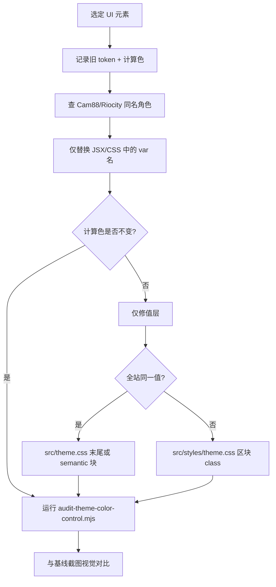

# Figma 变量规则（跨网站复用）

> **目的：** 在新网站、新页面、新模块里，**沿用同一套变量名**。换品牌/主题只改 `data-theme` 和 CSS 文件，**不要**在代码里改 `--color-*` 名字，也不要写死 hex。
>
> **完整变量清单：** [VARIABLES.md](./VARIABLES.md)（Figma 同步后 `node scripts/generate-variables-doc.mjs` 重生成）
>
> **English version:** [VARIABLE-RULES.en.md](./VARIABLE-RULES.en.md)

---

## 1. 核心原则（必记）

| 规则 | 说明 |
|------|------|
| **名字稳定** | 已发布的 `--color-*` / `--mono-*` 等名字视为 API，**禁止随意改名或删除**（见 [THEME_CSS_INCREMENTAL_UPDATE.md](./THEME_CSS_INCREMENTAL_UPDATE.md)） |
| **组件只用语义层** | HTML/CSS/组件里写 `var(--color-surface)`，不写 `var(--mono-900)`，不写 `#222222` — allowlist 与分层规则见 **§10.1** |
| **主题换色不改名** | Default ↔ CAM88 等同名变量，值在 `theme.css` / `theme-cam88.css` 里各自解析 |
| **新名字只给新模块** | 只有 Figma 里出现**新的 UI 角色/模块**时才加 token；同一按钮、同一 surface 不要另起 `--color-my-card-bg` |
| **Figma 是设计源** | 先在 Figma `02 Semantic` 加变量并绑好 alias，再同步到 repo，最后在新网站引用 |

### Caelo 仓库（本项目）

| 规则 | 操作 |
|------|------|
| 运行时 CSS | `src/index.css` → [src/theme.css](./src/theme.css) + [src/styles/theme.css](./src/styles/theme.css) 仅此两处 |
| Riocity 对照 | [src/theme-riocity.css](./src/theme-riocity.css) — **只读**名字 allowlist；**禁止 import** |
| 产品皮肤 | 保持 Caelo 蓝/白 + 金色 CTA；**不要**对本站使用 `data-theme="cam88"` |
| 迁移 | 完整 Riocity → Caelo 规则见 **§13** |

---

## 2. 两层结构（Figma ↔ CSS）

```
01 Primitives (Value)     →  hex / rgba，物理色板
        ↑ alias
02 Semantic (Default / CAM88 / …)  →  UI 角色，多 Mode 可指向不同 primitive
        ↑
   网页组件只引用这一层的 CSS 名
```

| 层级 | Figma 集合 | 谁用 | 示例 Figma | 示例 CSS |
|------|------------|------|------------|----------|
| 原始色 | `01 Primitives` | 设计系统维护；**网页一般不直接引用** | `mono/700` | `--mono-700` |
| 语义色 | `02 Semantic` | **所有页面、组件、新网站** | `color/text/primary` | `--color-text-primary` |
| 渐变合成 | `02 Semantic` 成对 start/end | 背景用 `linear-gradient` 时 | `color/gradient/home/cta/start` + `/end` | `--color-gradient-home-cta` |

### Figma → CSS 命名公式

1. 把 Figma 路径里的 `/` 换成 `-`
2. 前面加 `--`

```
mono/700              →  --mono-700
brand/500             →  --brand-500
raw-brand-cam         →  --raw-brand-cam
color/surface/float   →  --color-surface-float
color/gradient/home/cta/start + end  →  --color-gradient-home-cta
```

---

## 3. 语义变量模块（path 第一段）

新 token 必须落在已有 **module** 下，不要发明平行命名体系。

| Module（`color/{module}/…`） | 用途 | 引用示例 |
|------------------------------|------|----------|
| `text` | 文字颜色、标题、链接、placeholder | `--color-text-primary` |
| `surface` | 背景、卡片、输入框、表格、浮层 | `--color-surface`, `--color-surface-float` |
| `border` | 边框、分割线 | `--color-border`, `--color-border-brand` |
| `button` | 按钮背景/文字/分页/CTA 系列 | `--color-button-cta`, `--color-button-nav` |
| `primary` | 品牌主色（全局 CTA） | `--color-primary` |
| `accent` | 强调色、金色、chip | `--color-accent` |
| `error` / `danger` / `success` / `warning` | 状态色 | `--color-error-strong` |
| `overlay` | 遮罩、scrim | `--color-overlay` |
| `icon` | 图标色 | `--color-icon-um` |
| `gradient` | 渐变 stop（成对）+ 合成 `--color-gradient-*` | `--color-gradient-home-cta` |
| `popup` / `progress` / `table` / `sticky-nav` / `scrollbar` | 对应 UI 区块 | 见 [VARIABLES.md §7](./VARIABLES.md) |

**何时可以起新名字：** Figma 里新增了**新的 module 或新的 role**（例如新的 `color/surface/rtp-card`）。  
**何时不可以：** 只是换了一个相近的灰色——应复用已有 `color/surface/*` 或 `color/text/*`。

---

## 4. 在新网站接入（复制即用）

### 4.1 引入 CSS

```html
<link rel="stylesheet" href="/path/to/theme.css" />
<link rel="stylesheet" href="/path/to/theme-cam88.css" />
```

### 4.2 选主题

| 品牌 / Figma Mode | `data-theme` | 生效语义来自 |
|-------------------|--------------|--------------|
| Default（RioCity9） | `default` 或省略 | `theme.css` 的 `:root` |
| CAM88 | `cam88` | `theme-cam88.css` |

```html
<html lang="zh" data-theme="cam88">
```

### 4.3 组件样式模板

```css
/* ✅ 正确：语义变量 */
.page {
  background: var(--color-surface);
  color: var(--color-text-primary);
}
.card {
  background: var(--color-surface-float);
  border: 1px solid var(--color-border);
}
.btn-primary {
  background: var(--color-primary);
  color: var(--color-text-cta-inverse);
}
.hero {
  background: var(--color-gradient-home-cta);
}

/* ❌ 避免 */
.bad { background: #222222; }
.bad { color: var(--mono-0); }   /* 除非调试 primitive */
```

### 4.4 React / Vue / Tailwind 等

- **CSS Modules / SCSS：** 同样写 `var(--color-*)`
- **Tailwind：** 在 `theme.extend.colors` 里映射到 `var(--color-surface)` 等，**不要**在 Tailwind 里重新定义一套颜色名
- **内联 style：** 仍用 `style={{ background: 'var(--color-surface)' }}`

---

## 5. 常用语义变量（新页面优先对照）

与 [VARIABLES.md §7](./VARIABLES.md) 一致，新网站 80% 场景够用：

| 场景 | CSS 变量 |
|------|----------|
| 页面背景 | `--color-surface` |
| 主文字 | `--color-text-primary` |
| 次要文字 | `--color-text-secondary` |
| 弱化文字 | `--color-text-muted` |
| 品牌主色 / 主 CTA | `--color-primary` |
| 默认边框 | `--color-border` |
| 卡片 / 浮层 | `--color-surface-float` |
| 输入框底 | `--color-surface-input` |
| 链接 | `--color-text-link` |
| 错误 / 成功 / 警告 | `--color-error-strong` / `--color-success-strong` / `--color-warning` |
| Sticky 顶栏 | `--color-sticky-nav` + `--color-text-sticky-nav-text` |
| 遮罩 | `--color-overlay` |

找不到合适角色时：先查 [VARIABLES.md](./VARIABLES.md) 全文表，再考虑在 Figma 加语义变量（不要先在代码里硬编码）。

---

## 6. 渐变规则

1. Figma 里用 `color/gradient/{path}/start` 与 `…/end` 两个语义变量（alias 到 primitive）
2. CSS 生成一个合成变量：`--color-gradient-{path}`（`/` → `-`）
3. 网页里只引用合成变量：

```css
.banner {
  background: var(--color-gradient-home-cta);
}
```

`color/table/highlight/start|end` → `--color-gradient-table`。

### 6.1 Caelo：渐变颜色写在哪（`src/theme.css` `:root`）

> **规则：** 渐变的 **stop 色值** 与 **合成公式** 都放在 **`src/theme.css`**。Stop 用 `--raw-gradient-*` / `--raw-scrim-*`；合成必须用 **`--color-gradient-*` semantic 名**（与 `theme-riocity.css` 同名）。组件和 **`src/styles/theme.css`** 里不要写 stop hex、`linear-gradient(...)` 或 `--raw-gradient-{feature}` 整段 composite。

| 层级 | 变量命名 | 位置 | 谁引用 |
|------|----------|------|--------|
| **Stop** | `--raw-gradient-{feature}-start` / `-end` | `theme.css` `:root`（Caelo 块，`--color-table-highlight` 以下） | 仅 `--color-gradient-*` 公式 |
| **Scrim stop** | `--raw-scrim-*` | 同上 | 叠加层、光晕、多层 `--color-gradient-*` |
| **Composite（必须）** | `--color-gradient-{path}` | `theme.css` semantic 块 **或** `:root` 底部 Caelo 覆盖 | 组件 + 所有 `.bg-gradient-*` utility |

**新增或恢复渐变时的流程**

1. 在 `src/theme.css` 增加/更新 **stop**：`--raw-gradient-{feature}-start/end`（需要时加 `--raw-scrim-*`）。
2. 在同一文件把 **公式** 赋给 **`--color-gradient-*` semantic 名**：
   - 共用 UI → 最近的 Riocity `--color-gradient-*`（见 §13.6）。
   - 同一 semantic 名、不同 UI 区域 → **section scoped 覆盖**该 `--color-gradient-*`（§13.11），公式仍用 `var(--raw-*)` stop。
3. `src/styles/theme.css` 的 utility / 组件只写 **`var(--color-gradient-*)`** — 禁止内联 `linear-gradient`、禁止 `--raw-gradient-*` composite、禁止 stop hex。
4. 多个 utility 可共用同一 `--color-gradient-*`；同一 semantic 可在 utility 上 scope 不同公式（App Download 模式）。

```css
/* ✅ src/theme.css — stop + semantic composite */
--raw-gradient-promo-card-start: #d8f3ff;
--raw-gradient-promo-card-end: #a6d7f2;
--color-gradient-referral-card: linear-gradient(180deg, var(--raw-gradient-promo-card-start) 0%, var(--raw-gradient-promo-card-end) 100%);

/* ✅ src/styles/theme.css — utility 只用 semantic 名 */
.bg-gradient-promo-card { background-image: var(--color-gradient-referral-card); }

/* ❌ src/styles/theme.css — 不要在这里写公式或 raw composite */
.bg-gradient-promo-card { background-image: var(--raw-gradient-promo-card); }
.bg-gradient-promo-card { background-image: linear-gradient(180deg, #d8f3ff 0%, #a6d7f2 100%); }
```

---

## 7. Primitives 分组（仅供理解 alias）

网页不直接引用，但有助于读懂 `--color-*` 最终落在哪类色板上：

| 前缀 | 含义 |
|------|------|
| `mono/*` | 中性灰阶 |
| `brand/*` | 品牌绿（Default 主色来源） |
| `accent/*` | 金黄 / 促销强调 |
| `support/*` | 成功、错误、链接等功能色 |
| `overlay/*` | 半透明遮罩 |
| `raw-*` | 品牌/场景专用（CAM88 等大量语义指向此类） |
| `raw-gradient-*` | 渐变 stop 用的物理色 |

---

## 8. 多 Mode / 仅某一品牌有的变量

- `02 Semantic` 每个 **Mode**（Default、CAM88、KH168…）同一 Figma 名可 alias 到**不同** primitive
- 网页侧 **变量名相同**；只有 `data-theme` 决定读哪份 CSS
- 部分变量仅 Default 有 mode（例如 `--color-button-cta-category`）— CAM88 页面勿依赖未导出的名，以 [VARIABLES.md §3](./VARIABLES.md) 为准

---

## 9. 在 Figma 新增变量时的 checklist

1. **能复用吗？** 先在 `02 Semantic` 搜索相近 role（`surface`、`text`、`button`…）
2. **命名：** `color/{module}/{role}`，与现有 path 风格一致（kebab，用 `/` 分层）
3. **Alias：** 指向 `01 Primitives`（或链式 alias 到另一语义，导出时会保留 direct alias）
4. **Scopes：** 按用途设 TEXT_FILL / FRAME_FILL 等，避免 `ALL_SCOPES`
5. **每个品牌 Mode** 都设好 alias（Default + CAM88 至少）
6. **同步 repo：**
   ```bash
   node scripts/renew-both-themes.mjs
   node scripts/audit-themes.mjs
   node scripts/generate-variables-doc.mjs
   ```
7. **新网站：** 只加 `var(--color-新名)`，不改旧名

---

## 10. 禁止事项

| 不要 | 原因 |
|------|------|
| 在组件里写 hex/rgb | 无法换主题 |
| 在组件里用 `--mono-*` / `--brand-*` | 绕过语义层，CAM88 不会对 |
| 为同一 UI 发明第二套名字（如 `--card-bg`） | 与 Figma / 其他站不一致 |
| 同步时删除或重命名已有 CSS 变量 | 破坏已上线页面 |
| 迁移 Cam88 / Riocity semantic 名时改动 **resolved 色值** | 迁移 **只换名** — 新名 alias 到 **同一套** Caelo 值链（§13.11） |
| 在 Figma 用 `-` 当 primitive 名（如 `color-button-cta-end`） | 会被当成 semantic 形状；primitive 用 `group/name` 或 `raw-*` |

### 10.1 网站只用 Semantic 名（Caelo）

> **规则：** 所有**用户可见**的 UI（页面、组件、JSX `className`、inline `style`）的颜色必须经由 Riocity allowlist 里的 **`--color-*` semantic 名**解析（[src/theme-riocity.css](./src/theme-riocity.css)）。**禁止**在 UI 代码里直接引用 Figma **01 Primitives** 或 Caelo 值层 token。

**一句话：** 组件层只写 **semantic**（`--color-*`）；只有 `src/theme.css` 才写 **primitive**（`--mono-*`、`--brand-*`、`--raw-*`）。

#### 各层允许出现的位置

| 层级 | Token 示例 | 允许位置 |
|------|------------|----------|
| **01 Primitives** | `--mono-*`、`--brand-*`、`--accent-*`（数字 scale）、`--support-*`、`--raw-*` | **仅 `src/theme.css`** — semantic 块 alias + `--color-table-highlight` 以下 Caelo 块 |
| **02 Semantic（Riocity API）** | `--color-text-primary`、`--color-surface-base`、`--color-gradient-home-cta`、… | **组件**、**`src/styles/theme.css` utility**、区块 scoped class |
| **Legacy Caelo 布局/效果**（非 Riocity API） | `--shadow-*`、`--inset-*`、`--nav-top-pill-*`、`--surface-base`、`--surface-utility-*`、`--radius-*`、`--tracking-*` | **仅 `src/styles/theme.css` 定义** — 封装成 utility；**禁止**在 JSX 里新增 inline `var(--shadow-*)` |
| **写死色值** | `#…`、`rgb(…)`、Tailwind 调色板（`bg-blue-500`） | **产品 UI 禁止**（SVG 品牌资源 / ThemeEditor 开发工具除外） |

#### 组件（`src/components/**/*.jsx`）— 只允许

```tsx
// ✅ Riocity allowlist 的 semantic 色
className="bg-[var(--color-surface-base)] text-[var(--color-text-primary)]"

// ✅ 已在 CSS 里用 --color-* 的共享 utility（优先）
className="btn-theme-cta-soft surface-card bg-gradient-promo-card"

// ❌ Primitive
className="text-[var(--mono-0)]"

// ❌ Legacy Caelo alias（无 color- 前缀）
className="hover:bg-[var(--surface-base)]"

// ❌ JSX 里写布局/效果 primitive — 应移到 styles/theme.css 的 utility
className="shadow-[var(--shadow-card-soft)]"
```

#### `src/styles/theme.css` — utility 层

| 应该 | 不应该 |
|------|--------|
| `background` / `color` / `border-color` / `background-image` 只引用 **`var(--color-*)`** | 在 **CSS 属性右侧** 直接写 `--raw-*` / `--mono-*` / `--brand-*`（**除** §13.11 区块 scoped 的 `--color-*` 重 alias） |
| 文件顶部定义 legacy `--shadow-*` / `--inset-*`，对外暴露 `.shadow-card-soft` 等 | 新增 allowlist 以外的 Caelo 专属 **`--color-*`**（如 `--color-accent-200`） |
| 区块 scoped：`--color-border-brand: var(--raw-border-accent);` | utility 里内联 `linear-gradient(...)` + stop hex（§6.1） |

#### `src/theme.css` — primitive 唯一归属

- Semantic 块：每个 `--color-*` → `var(--mono-*)` / `var(--brand-*)` / `var(--raw-*)` / 其他 `--color-*`。
- `--color-table-highlight` 以下：`--raw-*` stop hex 与 Caelo 调色板覆盖。
- 运行时 **禁止 import** `theme-riocity.css`。

#### 审计（改 token 后执行）

```bash
node scripts/audit-theme-color-control.mjs
```

输出：[docs/theme-color-audit-data.json](./docs/theme-color-audit-data.json)。组件里的 **`primitiveDirect`**、**`disallowedSemantic`**、inline **`shadow-*` / `inset-*` / legacy `surface-*`** 均视为待迁移项。

#### Codebase 快照（2026-06-08）

| 发现 | 约计 | 位置 | 处理 |
|------|------|------|------|
| 组件内 `--color-*` | ~2900 处 | 多数 UI 文件 | ✅ 正确层级 |
| 组件内直接 `--mono-*` / `--brand-*` / `--raw-*` | **0** | — | ✅ 无 |
| Legacy `--surface-base` / `--surface-utility-*` | **2** | `Navbar.jsx`（移动菜单关闭 / More 图标） | 改为 `--color-surface-base` + semantic 图标色 |
| JSX inline `--shadow-*` | **~257** | ~80 个组件 | 迁入 utility（`.shadow-card-soft` 等）或等 Figma 补 semantic shadow |
| JSX inline `--inset-*` | **~25** | Navbar、RegisterPage、弹窗等 | 同上 — 仅 utility |
| `styles/theme.css` 内 `--raw-*` / `--mono-*` | **~64** | scoped 重 alias、page shell、渐变公式 | 仅允许写在 **`--color-*:` 赋值右侧**；裸 `background-color: var(--raw-…)` 为 legacy，待迁移 |
| allowlist 外 `--color-*` | **1** | `styles/theme.css` — `.sidenav-item:hover` 的 `--color-accent-200` | 换 allowlist 名 + scoped alias（§13.11） |
| 组件内 hex / rgb | **~500+** | ThemeEditor、FeaturesRow、ReferralStep3dIcons、支付 SVG、AppDownload 插画 | 产品页：迁 semantic；开发工具/SVG：隔离或文档例外 |

**清理优先级：** (1) JSX legacy `--surface-*` → (2) CSS 非 allowlist `--color-*` → (3) inline `--shadow-*` / `--inset-*` → (4) 非 SVG 产品组件里的 hex。

---

## 11. 相关文件

| 文件 | 作用 |
|------|------|
| [VARIABLES.md](./VARIABLES.md) | 全部变量名 + Default/CAM88 alias 对照（自动生成） |
| [src/theme-riocity.css](./src/theme-riocity.css) | **Semantic 名字标准**（Figma/Riocity 导出，318 个 `--color-*`）；Caelo **只读对照，不 import** |
| [src/theme.css](./src/theme.css) | **Caelo 运行时主题**：与 `theme-riocity.css` **同名** semantic，值为 Caelo 调色板 |
| [src/styles/theme.css](./src/styles/theme.css) | 布局别名、组件 utility class |
| [src/index.css](./src/index.css) | 入口：`theme.css` + `styles/theme.css` |
| [theme-cam88.css](./theme-cam88.css) | CAM88 主题 CSS（其他品牌站） |
| [figma-variables.json](./figma-variables.json) | 同步后的 JSON 源 |
| [THEME_CSS_INCREMENTAL_UPDATE.md](./THEME_CSS_INCREMENTAL_UPDATE.md) | 增量更新、禁止改名细则 |
| [generate-theme-css.mjs](./generate-theme-css.mjs) | JSON → CSS 生成器 |
| [scripts/audit-theme-color-control.mjs](./scripts/audit-theme-color-control.mjs) | 审计组件是否只用允许的 semantic 名 |
| [docs/theme-color-control-audit.md](./docs/theme-color-control-audit.md) | 迁移待办 + 绕过模式清单（见 §13） |
| [docs/theme-color-audit-data.json](./docs/theme-color-audit-data.json) | 上述脚本输出的机器可读数据 |

---

## 12. 一句话总结

**代码用 Riocity 名，`theme.css` 赋 Caelo 值 — 蓝/白皮肤不变；换 Figma 品牌只改值，永不改 `--color-*` 名字。**

---

## 13. Caelo 接入（Riocity semantic 名字 + Caelo 色值）

> **Caelo 迁移从这里开始。** Riocity/Cam88 提供**名字**；Caelo 提供**值**。站点外观须保持 12WIN（蓝/白 + 金色 CTA），而非 Riocity 绿/深/薰衣草紫。

### 13.0 迁移黄金法则

| 层 | 来源 | 规则 |
|----|------|------|
| **Riocity semantic 名字** | [src/theme-riocity.css](./src/theme-riocity.css) / Cam88 Figma `02 Semantic` 绑定 | **318 个 `--color-*` API** — 仅在组件中使用 |
| **Caelo 视觉值** | [src/theme.css](./src/theme.css) + [src/styles/theme.css](./src/styles/theme.css) 中的 scoped alias | 保持**迁移前 Caelo 颜色**（蓝/白/金） |
| **结果** | — | 外观与迁移前一致；仅 token **名字**与 Figma/Riocity 对齐 |

**要做 / 不要做**

| 要做 | 不要做 |
|------|--------|
| 在 JSX 中将旧 `--color-*` 换成 Riocity allowlist 名 | 从 `theme-riocity.css` 复制 `var(--mono-910)` 等目标 |
| **只换名** — 新 semantic 名 alias 到 **同一套** Caelo 值链（§13.11） | 迁移时改 hex、布局或样式 |
| 在 `--color-table-highlight` 以下用 `--raw-*` 保留 Caelo hex | 新增 allowlist 以外的 Caelo 专属 `--color-*` |
| 复用共享组件/utility（`GameCardPlayBar`、`ProviderLobbyTile`） | 在区块 CSS 中重复 `.game-card-play-*` 样式 |
| scoped CSS 仅用于**重定向值**（`--color-X: var(--old-Y)`） | scoped CSS 重定义布局或新 hover 体系 |

Cam88 Figma 决定**哪个名字用在哪个 UI 角色**；**不要**把 Cam88 布局抄进 Caelo（见 §13.10）。分步流程：**§13.12**。共享组件复用：**§13.13**。

### 13.0.1 Caelo 调色板身份（蓝/白皮肤）

Riocity 名表示**角色**。Caelo `--raw-*` primitive（`theme.css` 中 `--color-table-highlight` 以下）表示 **12WIN 外观**。

| UI 区域 | Caelo 外观 | 常用 token |
|---------|------------|------------|
| 页面 / 卡片 | 白 / 浅冷蓝 | `--color-surface-base`、`--color-surface-cool-light` |
| 品牌字 / 导航标签 | 海军蓝 | `--color-text-primary-card-title`、`--color-primary` |
| 主 CTA | 金色竖向渐变 | `--color-gradient-button-cta` |
| Footer / 深色条 | Caelo 海军蓝（非 Cam88 薰衣草紫） | `--color-surface-low` → Caelo `--raw-*` override |
| 游戏 hover | 共享遮罩 + 播放圆盘 | `--color-overlay`、`--color-surface-base`、`--color-primary`（`.game-card-play-*`） |

**不要**从 `theme-riocity.css` 复制 Riocity/Cam88 解析色并期望 Caelo 看起来像 Cam88 截图。

### 13.1 两层文件分工

| 层 | 文件 | 职责 |
|----|------|------|
| **02 Semantic 名字（标准）** | [src/theme-riocity.css](./src/theme-riocity.css) | Figma/Riocity 导出的 **318 个 `--color-*` 名字** = API；Caelo **永不修改此文件** |
| **02 Semantic 值（Caelo）** | [src/theme.css](./src/theme.css) | **必须用回完全相同的 semantic 名字**；每个 `--color-*` 指向 Caelo 的 `--raw-*` / `--mono-*` / `--brand-*` |
| **01 Primitives（Caelo）** | [src/theme.css](./src/theme.css) 中 `--color-table-highlight` **以下** | 仅调色板 hex；**禁止**在此段再定义 Caelo 专属 `--color-*` |
| **组件** | `src/components/**`、`src/styles/theme.css` | 只写 `var(--color-*)`，且名字必须存在于 `theme-riocity.css` |

```
Figma 02 Semantic
       ↓
theme-riocity.css  （318 个 --color-* 名字 = API，Caelo 只读）
       ↓ 同名
src/theme.css      （318 个 --color-*，值 = Caelo 蓝/白/金调色板）
       ↓
组件 / styles      （var(--color-*) only）
```

### 13.2 运行时引入

```css
/* src/index.css */
@import "./theme.css";
@import "./styles/theme.css";
```

**不要** `@import "./theme-riocity.css"`。Riocity 文件仅作名字对照与审计 allowlist。

### 13.3 正确 vs 错误示例

```css
/* ✅ Caelo theme.css：同名 semantic，Caelo 值 */
--color-surface-base: var(--raw-app-surface-base);
--color-text-primary: var(--raw-app-text-primary);
--color-text-primary-card-title: var(--raw-text-brand);
--color-gradient-button-cta: linear-gradient(180deg, var(--raw-cta-start) 0%, var(--raw-cta-end) 100%);

/* ✅ 组件 */
.nav-link { color: var(--color-text-primary-card-title); }
.cta { background: var(--color-gradient-button-cta); }

/* ❌ Riocity 解析 alias（Caelo 错误 — 会变绿/深色） */
--color-surface-base: var(--mono-910);

/* ✅ 同一 Riocity 名上的 Caelo alias（正确） */
--color-surface-base: var(--raw-app-surface-base);

/* ❌ Caelo 自创 semantic 名 */
--color-text-brand: …;
--color-accent-50: …;
--color-page-home: …;

/* ❌ 组件绕过语义层 */
.card { background: var(--mono-0); color: var(--raw-text-brand); }
```

### 13.4 禁止与允许

| 禁止 | 允许 |
|------|------|
| 在 Caelo 发明平行 `--color-*`（如 `--color-text-brand`、`--color-accent-50`、`--color-nav-border`） | `theme.css` 里用 Riocity 同名 token，值指向 Caelo primitive |
| 从 `theme-riocity.css` 复制 **resolved 色值** | 从 `theme-riocity.css` 只复制 **名字清单** |
| 组件里引用 `--mono-*` / `--raw-*` / `--brand-*` | 多个 UI 场景共用同一 Riocity `--color-gradient-*` 名（见 §13.6） |
| `theme.css` semantic 块出现 Riocity 没有的 `--color-*` | 在 `--color-table-highlight` 以下用 `--raw-*` 调 Caelo 品牌色 |

### 13.5 新 UI / 新 token 流程

1. 在 Figma `02 Semantic` 增加 `color/{module}/{role}`（或同步 Riocity repo）。
2. 确认 [src/theme-riocity.css](./src/theme-riocity.css) 已出现新 `--color-*` 名。
3. 在 [src/theme.css](./src/theme.css) **补同名**一行，alias 到 Caelo `--raw-*`（不要抄 Riocity 的 `var(--mono-*)` 目标）。
4. 组件里写 `var(--color-新名)`。
5. 运行 `node scripts/audit-theme-color-control.mjs` 确认无违规名。

### 13.6 渐变：Caelo 专属名 → 最近 Riocity 名

Caelo 历史上约有 90 个 Riocity 没有的 `--color-gradient-*`。迁移时：

1. 工具类 / 组件改为引用 **Riocity 已有的** `--color-gradient-*`（最近语义）。Utility **不要**引用 `--raw-gradient-{feature}` 整段 composite。
2. 把原先 Caelo 的 `linear-gradient(...)` **公式**写在 **`src/theme.css` `:root`** 的 **`--color-gradient-*` 名**上 — semantic 块或 Caelo 覆盖块 — 公式内只用 `var(--raw-*)` / `var(--brand-*)` stop（§6.1）。
3. **`src/styles/theme.css`** 中的 utility（如 `.bg-gradient-*`）只引用 **`var(--color-gradient-*)`** — 禁止内联渐变、stop hex、`--raw-gradient-*` composite。
4. 允许多个 utility 共用同一个 `--color-gradient-*` token。
5. **不要** 因名字相近就把 utility 指到错误的 Riocity gradient（例如 promo 卡片误用 `--color-gradient-home-highlight` 会破坏 App Download）。按下方表格选 semantic，或 section scope（§13.11）。

| 原 Caelo gradient（待删除） | 改用 Riocity `--color-gradient-*` |
|----------------------------|-----------------------------------|
| `register-page`、`account-shell` | `--color-gradient-home-dashboard` |
| `register-panel`、`referral-panel` | `--color-gradient-referral-panel` |
| `live-page`、`live-page-content` | `--color-gradient-card-brand` |
| `soft-panel`、`blue-panel`、`brand-soft-panel` | `--color-gradient-home-muted` |
| `nav-cta`、`mobile-cta` | `--color-gradient-home-cta` |
| `vip-nav-pill`、`language-nav` | `--color-gradient-side-menu-brand` |
| `app-download-*` | `--color-gradient-home-highlight`（在 `styles/theme.css` 按 utility section scope） |
| `content-hero-*`、`referral-glow-*` | `--color-gradient-home-card` |
| `favourite-*`、`game-card-*` | `--color-gradient-sports-card` |
| `scrollbar-*` | `--color-gradient-table` |
| `logout-*` | `--color-gradient-tag` |
| `promo-card`（mobile） | `--color-gradient-referral-card` |
| `promo-card-desktop` | `--color-gradient-referral-commission` |
| `promo-overlay` | `--color-gradient-referral-icon` |
| `promo-bottom-glow` | `--color-gradient-referral-deposit` |
| `promo-bottom-glow-soft` | `--color-gradient-sidenav-highlight` |

`--gradient-cta`（非标准别名）→ `--color-gradient-button-cta`。

### 13.7 常见 Caelo 旧名 → Riocity semantic 对照

迁移组件时按 **UI 角色** 复用 Riocity 名，不要保留旧名：

| Caelo 旧名（删除） | Riocity semantic（使用） |
|--------------------|--------------------------|
| `--color-text-brand` | `--color-text-primary-card-title` |
| `--color-accent-50` … `700` | `--color-accent-pale`、`--color-accent-glow`、`--color-accent`、`--color-button-hover`、`--color-border-subtle`、`--color-surface-cool-light`（按场景选） |
| `--color-cta-*`、`--gradient-cta` | `--color-gradient-button-cta`、`--color-text-cta-inverse`、`--color-button-cta-start` / `-end` |
| `--color-button-menu-selected-*` | `--color-button-menu-active` + `--color-border-brand` + `--color-text-cta-inverse` |
| `--color-nav-*` | `--color-sticky-nav`、`--color-text-sticky-nav-text`、`--color-button-nav`、`--color-border-subtle`、`--color-effect-glow` |
| `--color-page-*` | `--color-surface-base` 或 `--color-surface-cool-light` |
| `--color-payout-*` | `--color-surface-float`、`--color-text-recent-amount`、`--color-border-brand`、`--color-surface-card-light` |
| `--color-surface-muted` / `-soft` | `--color-surface-cool-light` / `--color-surface-float` |
| `--color-brand-soft*` | `--color-surface-cool-light` + `--color-border-brand` |
| `--color-universal-modal-*` | `--color-popup-head`、`--color-popup-body`、`--color-border-brand` |
| `--color-accent-800`（未定义） | `--color-accent` 或 `--color-button-hover` |
| `--color-nav-surface`（未定义） | `--color-sticky-nav` |

### 13.8 `theme.css` 与 Riocity 名字对齐清单

`theme-riocity.css` 同步或大规模迁移后，重新核对：

```bash
node scripts/audit-theme-color-control.mjs
```

对照 [src/theme.css](./src/theme.css) 与 [src/theme-riocity.css](./src/theme-riocity.css) 中的 `--color-*` 定义。迁移待办与绕过模式：[docs/theme-color-control-audit.md](./docs/theme-color-control-audit.md)。

| 状态 | 动作 |
|------|------|
| 两边都有 | 保留；确保**值**用 Caelo `--raw-*`，非 Riocity 默认 alias |
| 仅 Riocity 有 | 在 `src/theme.css` 补同名 + Caelo 值 |
| 仅 Caelo 有（旧名） | 从 `theme.css` 与组件删除；迁移到 Riocity 名（§13.7） |

历史快照（仅供参考 — 请重新 diff 刷新数量）：约 305 共有、约 16 仅 Riocity 需补、约 156 仅 Caelo 需删。

### 13.9 审计与验收

```bash
node scripts/audit-theme-color-control.mjs
npm run build
```

验收：

- [ ] `src/theme.css` semantic 块仅有 Riocity 的 `--color-*` 名（`--color-table-highlight` 以上无 Caelo 专属 semantic）
- [ ] `src/components`、`src/styles` 中 `var(--color-*)` 均在 `theme-riocity.css` allowlist 内
- [ ] 适用处复用共享模式（`GameCardPlayBar`、`ProviderLobbyTile`）— 无重复区块 play-overlay CSS（§13.13）
- [ ] 视觉：顶栏浅色 + 品牌蓝字、金色 CTA、账户 Tab、移动抽屉；**非** Riocity 绿/深/薰衣草紫
- [ ] 运行时未 import `theme-riocity.css`
- [ ] 可选：Riocity 同步后扩展 `audit-theme-color-control.mjs` 做 allowlist 漂移检查

### 13.10 Cam88 Figma 对齐 — 同名、同位置，不新增 Caelo 设计

> **Caelo 策略：** 以 **Cam88** Figma 为准，对齐 **semantic 变量名及其应用位置**。不要把 Cam88 的布局、文案或新 Frame 抄进 Caelo 做 redesign。只改代码里的 **名字**，以及 `src/theme.css` / scoped CSS 里的 **值**。**解析色必须保持 Caelo** — 见 **§13.11**。分步流程见 **§13.12**。

| 要做 | 不要做 |
|------|--------|
| 查看 Cam88 Figma 各图层绑定的 `02 Semantic`（如 Footer frame） | 把 Cam88 布局、区块、文案复制到 Caelo |
| 将旧名 / Caelo 专属 `var(--color-*)` 换成**同一 UI 角色**上的 Riocity 名 | 在 Caelo 里新增 Footer 菜单、信息栏、或整套新 CSS utility |
| 在 `theme.css` 的 `--color-table-highlight` **以下**为这些名字赋 **Caelo 色值** | 在组件里使用 Cam88 在 `theme-riocity.css` 里的 **resolved hex** |
| 保留现有 Caelo DOM 结构、间距与组件 | 除非组件原本就有该模式，否则不要用 Figma 图层名做 `data-name` 或 BEM 重构 |

**流程**

1. 打开 Cam88 Figma Frame，定位到**与迁移元素相同的图层**（例：[Riocity-MCP → Footer `1276:47259`](https://www.figma.com/design/UAdiwF7uYbVMqq8ky3Fn0n/Riocity-MCP?node-id=1276-47259)）。
2. 对每个**已存在**的 Caelo 元素（同一视觉角色），记下绑定的 semantic（如 `color/surface/low` → `--color-surface-low`）。
3. 在组件里**只替换** `var(--color-*)` 引用 — **同一元素、同一位置**。
4. 在 `src/theme.css` 为该 semantic 赋 **Caelo 值**（经 `--raw-*` 或在文件末尾 targeted override）。**不要**新增 `--color-*` 名。

**示例 — Footer（Cam88 frame [Footer `1276:47259`](https://www.figma.com/design/UAdiwF7uYbVMqq8ky3Fn0n/Riocity-MCP?node-id=1276-47259)）**

Caelo 保留现有 Footer 布局（12WIN logo、支付方式、About Us 链接、认证区）。仅 token 名与 Cam88 绑定一致：

| Caelo Footer 同一位置 | Cam88 semantic（组件中使用） | Caelo 色值（仅在 `theme.css` 设置） |
|----------------------|------------------------------|--------------------------------------|
| Footer 背景 | `--color-surface-low` | `var(--raw-gradient-vip-nav-pill-start)`（Caelo 蓝；非 Cam88 薰衣草紫） |
| 描述、区块标题、版权 | `--color-text-footer` | `var(--mono-0)`（semantic 块已有） |
| 行内导航链接 | `--color-text-light` | 深色 Footer 上用 `var(--mono-0)`（Caelo primitive 段 override） |
| Footer / 区块分割线 | `--color-border-line` | Caelo 的 `--mono-*` / `--raw-app-border` 链 |
| 支付方式 chip | `--color-surface` + `--color-border-line` | 蓝底上的浅色 chip（`--raw-app-surface`） |

```css
/* src/theme.css — :root 末尾，Cam88/Riocity 名 + Caelo 值 */
--color-surface-low: var(--raw-gradient-vip-nav-pill-start);
--color-text-light: var(--mono-0);
```

```jsx
/* ✅ 同一 Footer 元素，换 Cam88 semantic 名 */
<footer className="… bg-[var(--color-surface-low)] …">
<p className="… text-[var(--color-text-footer)]">…</p>
<button className="… text-[var(--color-text-light)] hover:text-[var(--color-text-footer)]">…</button>

/* ❌ 不要加 Cam88 独有 UI */
<nav data-name="Menu">…</nav>
<div data-name="Background">Information Center | FAQ …</div>
```

**导航、卡片、弹窗**等模块同样遵循：Cam88 名 + Caelo 值，Caelo UI 不变；除非产品明确要求改布局。

### 13.11 保留 Caelo 色值 — 仅换 semantic 名

> **规则：** 迁移 **只替换** 组件与 utility 里的 `--color-*` **名字**。**不要改动现有 color 值** — 屏幕上解析出的颜色必须与迁移前 Caelo 一致。Cam88 / Riocity 名表示 **角色**；Caelo 的 `--raw-*` / alias 链表示 **外观**。不要把 `theme-riocity.css` 的 Cam88 hex 写进组件，也不要用 Riocity 默认 alias 替换 Caelo 调色板。

**一句话：** 只更新 semantic **名字**，保持 resolved **色值**不变。

| 步骤 | 操作 |
|------|------|
| 1 | 记录该元素 **改名前** 的 `var(--color-*)` 及 **Caelo 实际色值**。 |
| 2 | 按同一 UI 角色，从 Riocity allowlist（`theme-riocity.css`）选取 **Cam88 绑定的 semantic 名**。 |
| 3 | 仅在 JSX / CSS 中替换 `var(--color-*)` **名字** — **不改布局、间距、边框、背景或 DOM**（除非迁移前本来就有）。 |
| 4 | 在 `src/theme.css`（或 `src/styles/theme.css` 的 scoped class）里，让 **新名** alias 到 **旧名使用的同一值链** — 例如 `--color-surface-rtp-card: var(--color-primary)`，不要写新 hex。 |
| 5 | 与 git / staging 视觉对比后再验收。 |

**禁止**

- 为贴近 Cam88 截图而改 Caelo hex 或选用新的 palette stop。
- 让新 semantic 名指向与旧 token **不同** 的 `--raw-*` / `--brand-*` 目标（等于改色值）。
- 增加迁移前没有的视觉样式（例如 footer RTP 加 pill 背景、改圆角）。
- 在 `theme.css` 末尾做会破坏其他页面的全局 override — 改用 scoped class。
- 新增 Riocity allowlist 以外的 `--color-*` 名。

**同一 Caelo 色值写在哪里（优先级）**

1. **`src/theme.css` — `:root` 末尾（`--color-table-highlight` 以下）** — 新 Cam88 名全站应与旧 token **同一值链**（如 `--color-surface-rtp-card: var(--color-primary)`）。
2. **`src/styles/theme.css` 区块 scoped class** — Cam88 名正确，但 **本区块旧色** 与同 token 在其他页面不同。
3. **子选择器覆盖** — 同一区块内两个元素 Cam88 名相同但 Caelo 旧色不同。

**示例 — Game card RTP（Cam88 [Web_Home → Game Section `972:28054`](https://www.figma.com/design/UAdiwF7uYbVMqq8ky3Fn0n/Riocity-MCP?node-id=972-28054)）**

只换名 — **footer RTP 不要加** Cam88 那种独立 pill 底；保持 Caelo 蓝底上的白字：

| Caelo 同一位置 | 旧 token（删除） | Cam88 semantic（使用） | 同一 Caelo 值（alias） |
|----------------|------------------|------------------------|-------------------------|
| 卡片 footer 背景 | `--color-primary` | `--color-surface-rtp-card` | `theme.css` 末尾 `var(--color-primary)` |
| Footer RTP 文字 | `--color-text-card-text` | `--color-surface-rtp-secondary-card-text` | `var(--mono-0)` |
| 详情页 RTP pill 底 | `--color-accent-50` / `--color-accent-pale` | `--color-surface-rtp-secondary-card` | `.rtp-label--pill { …: var(--color-accent-pale); }` |
| 详情页 RTP pill 字 | `--color-accent-700` / `--color-button-hover` | `--color-surface-rtp-secondary-card-text` | `.rtp-label--pill { …: var(--color-button-hover); }` |

```css
/* src/theme.css — 新 semantic 名，旧值链 */
--color-surface-rtp-card: var(--color-primary);
--color-surface-rtp-secondary-card-text: var(--mono-0);
```

**示例 — Recent Big Wins（Cam88 [Home - Cam88 → Recent Big Wins `974:29004`](https://www.figma.com/design/UAdiwF7uYbVMqq8ky3Fn0n/Riocity-MCP?node-id=974-29004)）**

Caelo 保留滚动列表（非 Cam88 双列卡片）。组件用 Cam88 名；scoped alias 恢复 Caelo 色：

| Caelo 同一位置 | Cam88 semantic（组件） | Caelo 色值（方式） | Figma 节点 |
|----------------|------------------------|-------------------|------------|
| 行分割线 | `--color-border-line` | `.recent-big-wins-section { --color-border-line: var(--color-border-subtle); }` | [`974:29004`](https://www.figma.com/design/UAdiwF7uYbVMqq8ky3Fn0n/Riocity-MCP?node-id=974-29004) |
| 缩略图 + provider chip 底 | `--color-surface-panel` | 区块内 `--color-surface-panel: var(--raw-surface-muted)` | [`974:29095`](https://www.figma.com/design/UAdiwF7uYbVMqq8ky3Fn0n/Riocity-MCP?node-id=974-29095) |
| 缩略图描边 | `--color-border-brand` | `.recent-big-wins-thumb { --color-border-brand: var(--raw-border-accent); }` | [`974:29004`](https://www.figma.com/design/UAdiwF7uYbVMqq8ky3Fn0n/Riocity-MCP?node-id=974-29004) |
| Provider chip 字 | `--color-text-subtle` | semantic 块已有 | [`974:29095`](https://www.figma.com/design/UAdiwF7uYbVMqq8ky3Fn0n/Riocity-MCP?node-id=974-29095) |
| 游戏名 | `--color-text-primary` | 不变 | [`974:29098`](https://www.figma.com/design/UAdiwF7uYbVMqq8ky3Fn0n/Riocity-MCP?node-id=974-29098) |
| 中奖金额 | `--color-text-recent-amount` | 区块 scope → `var(--color-button-hover)`（Caelo 蓝，非 Cam88 红） | [`974:29099`](https://www.figma.com/design/UAdiwF7uYbVMqq8ky3Fn0n/Riocity-MCP?node-id=974-29099) |
| 时间 | `--color-button-hover` | 不变 | — |
| 标题 “Recent” | `--color-text-primary` | 不变 | [`974:29007`](https://www.figma.com/design/UAdiwF7uYbVMqq8ky3Fn0n/Riocity-MCP?node-id=974-29007) |
| 标题 “Big Wins” | `--color-text-recent-amount` | 子选择器 → `var(--color-primary)` | [`974:29007`](https://www.figma.com/design/UAdiwF7uYbVMqq8ky3Fn0n/Riocity-MCP?node-id=974-29007) |

```css
/* src/styles/theme.css */
.recent-big-wins-section {
  --color-border-line: var(--color-border-subtle);
  --color-surface-panel: var(--raw-surface-muted);
  --color-text-recent-amount: var(--color-button-hover);
}
.recent-big-wins-section .recent-big-wins-title-highlight {
  color: var(--color-primary);
}
.recent-big-wins-section .recent-big-wins-thumb {
  --color-border-brand: var(--raw-border-accent);
}
```

**示例 — Recent Payout（Cam88 [Home - Cam88 → Recent Payout 区块 `974:29215`](https://www.figma.com/design/UAdiwF7uYbVMqq8ky3Fn0n/Riocity-MCP?node-id=974-29215)；[卡片详情 `974:29306`](https://www.figma.com/design/UAdiwF7uYbVMqq8ky3Fn0n/Riocity-MCP?node-id=974-29306)）**

Caelo 保留轮播布局。组件用 Cam88 名；scoped alias 恢复 Caelo 色：

| Caelo 同一位置 | Cam88 semantic | Caelo 色值（方式） | Figma 节点 |
|----------------|----------------|-------------------|------------|
| 面板描边 | `--color-border-brand` | `.recent-payout-section { --color-border-brand: var(--color-primary); }` | [`974:29215`](https://www.figma.com/design/UAdiwF7uYbVMqq8ky3Fn0n/Riocity-MCP?node-id=974-29215) |
| 面板背景 | `--color-surface-base` | 不变（非 Cam88 薰衣草 `--color-surface-elevated`） | [`974:29215`](https://www.figma.com/design/UAdiwF7uYbVMqq8ky3Fn0n/Riocity-MCP?node-id=974-29215) |
| 面板阴影 | `--color-effect-glow` | 不变 | [`974:29215`](https://www.figma.com/design/UAdiwF7uYbVMqq8ky3Fn0n/Riocity-MCP?node-id=974-29215) |
| 标题 “RECENT” | `--color-text-primary` | 子选择器 → `var(--color-text-primary-card-title)` | [`974:29219`](https://www.figma.com/design/UAdiwF7uYbVMqq8ky3Fn0n/Riocity-MCP?node-id=974-29219) |
| 标题 “PAYOUT” | `--color-text-recent-amount` | 子选择器 → `var(--color-text-primary)` | [`974:29219`](https://www.figma.com/design/UAdiwF7uYbVMqq8ky3Fn0n/Riocity-MCP?node-id=974-29219) |
| 卡片背景 | `--color-surface-panel` | 区块 scope → `var(--color-accent-pale)` | [`974:29303`](https://www.figma.com/design/UAdiwF7uYbVMqq8ky3Fn0n/Riocity-MCP?node-id=974-29303) |
| 游戏名 | `--color-text-primary` | 卡片上不变 | [`974:29308`](https://www.figma.com/design/UAdiwF7uYbVMqq8ky3Fn0n/Riocity-MCP?node-id=974-29308) |
| 用户 ID | `--color-text-primary` | 卡片上不变 | [`974:29310`](https://www.figma.com/design/UAdiwF7uYbVMqq8ky3Fn0n/Riocity-MCP?node-id=974-29310) |
| 金额 | `--color-text-recent-amount` | semantic 块 `--raw-payout-amount` | [`974:29312`](https://www.figma.com/design/UAdiwF7uYbVMqq8ky3Fn0n/Riocity-MCP?node-id=974-29312) |
| 焦点环 | `--color-text-primary-card-title` | 不变蓝色 outline | — |

```css
.recent-payout-section {
  --color-border-brand: var(--color-primary);
  --color-surface-panel: var(--color-accent-pale);
}
.recent-payout-section .recent-payout-header__title-recent {
  color: var(--color-text-primary-card-title);
}
.recent-payout-section .recent-payout-header__title-payout {
  color: var(--color-text-primary);
}
```

```jsx
/* ✅ 卡片详情 Cam88 名（Figma `974:29306`） */
<p className="recent-payout-card__title text-[var(--color-text-primary)]">{item.game}</p>
<p className="recent-payout-card__user text-[var(--color-text-primary)]">{item.user}</p>
<p className="recent-payout-card__amount text-[var(--color-text-recent-amount)]">{item.amount}</p>
```

### 13.12 分步迁移流程

每个组件/区块迁移时使用。完整决策流：



**步骤**

1. **基线** — 改动前记录旧 `var(--color-*)`（或旧名）及 DevTools **计算色**。
2. **选 Riocity 名** — Cam88 Figma 同层绑定，或搜索 [src/theme-riocity.css](./src/theme-riocity.css)。旧 Caelo 名见 **§13.7**。
3. **组件改名** — 仅替换 JSX / CSS 中的 token 字符串。**DOM、布局、共享组件不变。**
4. **保留色值** — 改名后颜色变了，**只修值层**（顺序见 §13.11）：
   - (a) 全局：`src/theme.css` semantic 块或 `:root` 中 `--color-table-highlight` 以下
   - (b) 区块 scope：`.my-section { --color-X: var(--old-Y); }` 写在 `src/styles/theme.css`
   - (c) 子选择器：`.my-section .my-title { color: var(--color-primary); }`
5. **复用行为** — 若 UI 与现有模式一致（游戏播放遮罩、lobby 卡片、卡片 hover），挂载共享组件 — **§13.13**。不要写平行 CSS。
6. **验收** — `node scripts/audit-theme-color-control.mjs`、`npm run build`、与基线视觉对比。

**示例：** `--color-text-brand` 改为 `--color-text-primary-card-title` 后文字变灰？

- **错误：** 在 JSX 写死 `#123b94`。
- **正确：** 在 `src/theme.css` 确保 `--color-text-primary-card-title: var(--raw-text-brand);`（若仅本区块不同则用 scope）。

### 13.13 复用共享模式（禁止区块重复样式）

区块 CSS 可以 **重定向** `--color-*` 值（§13.11），**不得**重定义共享交互或卡片视觉。

| 模式 | 组件 / class | Token（已在 `styles/theme.css` 接好） |
|------|--------------|----------------------------------------|
| 游戏 hover 遮罩 | [`GameCardPlayBar`](src/components/game/GameCardActions.jsx)、`.game-card-play-overlay`、`.game-card-play-button`、`.group` + `.game-card-play-hover` | `--color-overlay`、`--color-surface-base`、`--color-primary`、`--shadow-card-soft` |
| Lobby 提供商卡片 | [`ProviderLobbyTile`](src/components/game/ProviderLobbyTile.jsx)、`.provider-lobby-card__*` | `--color-surface-mid-color`、`--color-border-subtle`、`--color-surface-input-light`、`--color-text-tertiary` |
| 卡片 hover 抬升 | [`GAME_CARD_HOVER_CLASS`](src/components/game/gameCardHover.js) | `--shadow-card-hover` |

**正确**

```jsx
/* ✅ Recent Big Wins — 整行 hover，共享 GameCardPlayBar */
<div className="recent-big-wins-row group relative …">
  <GameCardPlayBar showOnHover gameName={item.game} gameProvider={item.provider} onNavigate={onNavigate} />
</div>
```

**错误**

```css
/* ❌ 重复 .game-card-play-button — 禁止 */
.recent-big-wins-row .game-card-play-button {
  background-color: var(--color-primary);
  width: 2.75rem;
}
```

若区块需要与游戏卡片**相同的交互**，使用**相同组件与 class**。若仅**颜色**不同，只做 scoped `--color-*` alias — 绝不重复 overlay/按钮规则。
