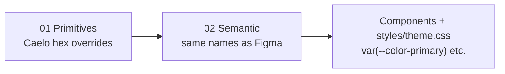

# Plan: Figma color tokens for Caelo

Apply the Figma variable system from [`src/theme.css`](../src/theme.css) to the Caelo website. Reuse **the same semantic token names** from the Figma export; retune **primitive values** so the site keeps its current blue/light look.

Reference: [riocity-figma plan.md](https://github.com/vincentyap91/riocity-figma/blob/main/plan.md)

---

## Goal

**Do not** add a parallel legacy bridge (`--color-brand-primary`, `--color-border-default`, etc.).

Instead:

1. **Reuse Figma semantic names** in code — `--color-primary`, `--color-border`, `--color-text-primary`, …
2. **Apply new primitive colors** so those semantics resolve to the current Caelo UI.
3. Add **only missing** primitives below `--color-table-highlight` when no existing primitive slot fits.

**Palette:** Keep Caelo blue/light appearance (not RioCity9 green `#45ff8b`).

---

## Architecture



Per Figma plan: application code uses **semantics only**; primitives hold raw values.

**Current state:**

| File | Role | Imported? |
|------|------|-----------|
| [`src/theme.css`](../src/theme.css) | Figma 01 Primitives + 02 Semantic | No |
| [`src/styles/theme.css`](../src/styles/theme.css) | Legacy Caelo tokens + component classes | Yes (via `index.css`) |

---

## Phase 1 — Wire imports

Update [`src/index.css`](../src/index.css):

```css
@import "./theme.css";
@import "./styles/theme.css";
```

Load Figma tokens first; app styles second.

---

## Phase 2 — Caelo primitive overrides

Add overrides **below `--color-table-highlight`** in [`src/theme.css`](../src/theme.css) (after line 654).

Reassign **existing primitive names** to Caelo values:

```css
  /* ---------------------------------------------------------------------------
     Caelo primitive overrides — RioCity9 export retuned for blue/light site
     --------------------------------------------------------------------------- */
  --brand-500: #123B94;
  --brand-400: #1a4bb8;
  --brand-630: #0d2a6a;
  --brand-700: #01206C;
  --brand-500-soft: rgb(18 59 148 / 0.2);

  --accent-400: #ffd84d;       /* nav gold / highlights */
  --accent-460: #ffcf4a;       /* CTA start */
  --support-warning: #ffb22d;  /* CTA end tone */

  /* New primitives only where no slot exists */
  --raw-page-home: #e6f4fd;
  --raw-page-register: #edf4ff;
  --raw-page-account: #eaf1fb;
  --raw-cta-border: #f0bb3d;
  --raw-cta-text: #0c4a8e;
  /* …audit remainder from styles/theme.css hex … */
```

**Rules:**

- Prefer remapping `--brand-*`, `--accent-*`, `--support-*`, `--mono-*` before adding `--raw-*`.
- Do not edit the generated 01/02 blocks above `--color-table-highlight` when syncing from Figma re-export (only append below the line).

---

## Phase 3 — Semantic pointer overrides (light UI)

Some Figma semantics default to **dark dashboard** values. Keep the **semantic name**; repoint to light primitives below `--color-table-highlight`:

| Semantic (unchanged name) | Figma default | Caelo override |
|---------------------------|---------------|----------------|
| `--color-primary` | `var(--brand-500)` | Auto-fix when `--brand-500` → blue |
| `--color-surface` | `var(--mono-900)` | `var(--mono-0)` for light page background |
| `--color-text-primary` | `var(--mono-0)` white | `var(--mono-950)` for body text on light pages |
| `--color-text-secondary` | `var(--mono-400)` | Tune via `--mono-500` or explicit override |
| `--color-border` | `var(--mono-700)` | `var(--mono-255)` / `#e2e8f0` for light dividers |
| `--color-border-brand` | `var(--brand-500)` | Auto-fix via brand primitive |
| `--color-button-cta` | `var(--brand-500)` | Point to CTA accent / `--color-gradient-button-cta` |

Only override semantics where primitive retuning alone is insufficient.

---

## Phase 4 — Migrate codebase (legacy → Figma semantic)

Remove legacy `:root` color definitions from [`src/styles/theme.css`](../src/styles/theme.css) and rename usages across `src/`:

| Legacy (remove) | Figma semantic (use) |
|-----------------|----------------------|
| `--color-brand-primary` | `--color-primary` |
| `--color-brand-secondary` | `--brand-630` or `--color-button-hover` |
| `--color-brand-deep` | `--brand-700` |
| `--color-surface-base` | `--color-surface` (after light override) |
| `--color-surface-muted` | `--color-surface-subtle` |
| `--color-text-strong` | `--color-text-primary` (after ink override) |
| `--color-text-main` | `--color-text-secondary` |
| `--color-text-muted` | `--color-text-muted` (same name; override primitive target) |
| `--color-text-soft` | `--color-text-faded` or `--color-text-light` |
| `--color-border-default` | `--color-border-subtle` or `--color-border` |
| `--color-border-brand` | `--color-border-brand` |
| `--color-success-main` | `--color-success` |
| `--color-danger-main` | `--color-danger` |
| `--color-nav-top` / `--color-nav-main` | `--color-primary` or `--color-surface-nav` |
| `--color-nav-accent` | `--color-accent` |
| `--color-cta-*` / `--gradient-cta` | `--color-gradient-button-cta` + CTA primitives |

**Nav / app-specific tokens** (`--color-nav-text-soft`, `--nav-top-pill-*`, payout tokens): if no Figma semantic exists, add a **new primitive** below `--color-table-highlight`, then a **new semantic** (e.g. `--color-nav-text-soft: var(--raw-nav-text-soft)`) per plan.md naming.

**Migration order:**

1. [`src/styles/theme.css`](../src/styles/theme.css) — `:root` + `@layer components`
2. High-traffic components: `Navbar.jsx`, `AccountSidebar.jsx`, `ProfilePage.jsx`
3. Bulk grep/replace remaining legacy token names
4. [`ThemeEditorConfig.js`](../src/components/theme-editor/ThemeEditorConfig.js) — target `--color-primary`, not `--color-brand-primary`

**Keep in `styles/theme.css`:** fonts, letter-spacing, shadows, radii, layout, component utility classes. Replace hardcoded hex inside those rules with `var(--color-*)`.

---

## Phase 5 — Verify

- [ ] `npm run build` passes
- [ ] No `--color-brand-primary`, `--color-border-default`, `--color-text-strong` in `src/` (post-migration)
- [ ] Caelo hex values live only in `src/theme.css` override block (below `--color-table-highlight`)
- [ ] Visual check: nav, home, account, CTA, profile logout — same blue/light look as before

---

## Regeneration note

When Figma re-exports `theme.css`, preserve everything **below `--color-table-highlight`**.

Optional: extract overrides to [`src/styles/caelo-token-overrides.css`](../src/styles/caelo-token-overrides.css) and import after `theme.css` so regen does not wipe Caelo values.

---

## Files to change

| File | Change |
|------|--------|
| [`src/index.css`](../src/index.css) | Import `theme.css` first |
| [`src/theme.css`](../src/theme.css) | Caelo primitive + semantic overrides below `--color-table-highlight` |
| [`src/styles/theme.css`](../src/styles/theme.css) | Remove legacy colors; use Figma semantics |
| `src/components/**` | Rename legacy `var(--color-*)` → Figma semantics |
| [`src/components/theme-editor/ThemeEditorConfig.js`](../src/components/theme-editor/ThemeEditorConfig.js) | Figma semantic names |

---

## Implementation checklist

- [ ] Import `theme.css` in `index.css`
- [ ] Add Caelo primitive overrides below `--color-table-highlight`
- [ ] Add semantic pointer overrides for light UI
- [ ] Audit + migrate `styles/theme.css`
- [ ] Migrate components (legacy → Figma semantic names)
- [ ] Update Theme Editor config
- [ ] Build + visual verification
